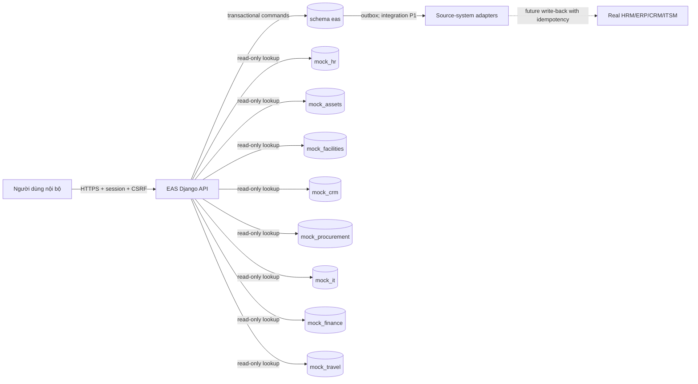
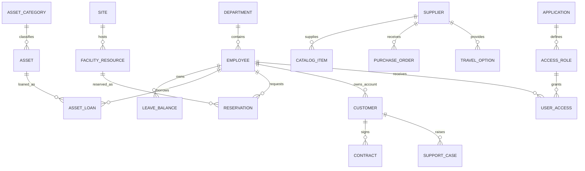
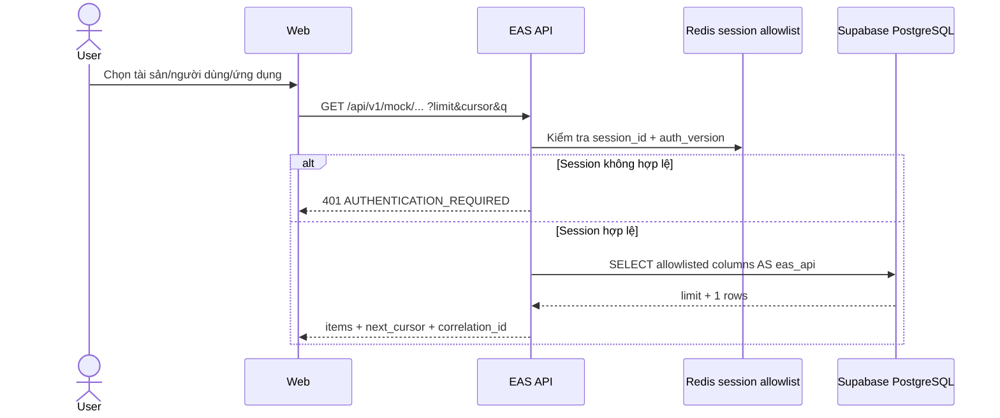

# Nền tảng dữ liệu doanh nghiệp giả lập và API tích hợp

| Thuộc tính | Giá trị |
|---|---|
| Mã tài liệu | EAS-DES-INT-012 |
| Phiên bản | 1.3.0 |
| Ngày | 09/10/2026 |
| Trạng thái | IMPLEMENTED; Supabase schema/seed VERIFIED, API unit VERIFIED, E2E NOT RUN |
| Phạm vi | Development/demo; dữ liệu hoàn toàn tổng hợp |

## 1. Quyết định kiến trúc

EAS vẫn là system of record cho yêu cầu, phê duyệt, thực thi, audit và SLA. Các schema `mock_*` đóng vai hệ thống nguồn giả lập; EAS chỉ đọc dữ liệu tham chiếu qua backend. Không nhân bản dữ liệu lương, định danh cá nhân, tài khoản ngân hàng hoặc bí mật khách hàng.

Thiết kế tham khảo các phẩm chất của nền tảng API thương mại điện tử quy mô lớn: chia API theo resource/module, có môi trường thử nghiệm, request identifier, mã lỗi ổn định, phân trang và trạng thái tài nguyên. Không sao chép API, chữ ký hay dữ liệu của Shopee. Nguồn tham khảo chất lượng: [ShopeeFood Partner API](https://developer.shopeefood.co.id/vendor/api-docs) và [tài liệu Open API do Shopee phát hành trên CDN](https://cdngarenanow-a.akamaihd.net/shopee/seller/seller_cms/3a486040f6e64972f6dd53128a79f0dc/%5BTW%5D%5BOpen%20API%5DAPI%E4%B8%B2%E6%8E%A5%E8%AA%AA%E6%98%8E%E4%BA%8B%E9%A0%85%20%282020_09%29_newnew.pdf).

### INT-D01 — System context

Liên kết: FR tích hợp dữ liệu nguồn; UC01/UC04/UC08/UC10; test `test_mock_sources.py`.



## 2. Coverage các yêu cầu nội bộ

| Nhóm request | Dữ liệu nguồn | Trạng thái trong EAS |
|---|---|---|
| Nghỉ phép | employee, manager, department, leave_balance | P0 `LEAVE` |
| Cấp quyền hệ thống | application, access_role, user_access, employee | P0 `ACCESS` |
| Mượn/cấp thiết bị | asset, category, loan, supplier, catalog item | P0 `EQUIPMENT` |
| Đặt phòng/bàn/xe | site, resource, reservation | P1 — cần CR và workflow release |
| Mua sắm/thanh toán | supplier, catalog item, purchase order, budget | P1 |
| Hoàn ứng/chi phí | expense category, budget | P1 |
| Công tác | travel policy, travel option, supplier, budget | P1 |
| IT service | service catalog, application | P1 |
| Onboarding/offboarding | employee status, department, access, asset loan | P1 |
| Ngoại lệ khách hàng/hợp đồng | customer, contract, support case | P1 |

Không tự động kích hoạt các loại P1. Mỗi loại cần change request cập nhật SRS, workflow release, authorization, retention, API command và test trước khi cho phép tạo yêu cầu.

## 3. ERD khái quát

### INT-D02 — Cross-domain reference model



ERD vật lý đầy đủ nằm trong [SQL installer](../database/mock_enterprise_sql/00_mock_enterprise_schemas.sql); từ điển triển khai nằm trong [README gói mock](../database/mock_enterprise_sql/README.md).

## 4. API contract

Base path: `/api/v1/mock`. Tất cả endpoint yêu cầu session hợp lệ và ít nhất một role EAS. Runtime kết nối database bằng `eas_api`; trình duyệt không truy cập trực tiếp schema mock.

| Domain | GET endpoints |
|---|---|
| HR | `/hr/departments`, `/hr/employees`, `/hr/leave-balances` |
| Assets | `/assets/items`, `/assets/loans` |
| Facilities | `/facilities/resources` |
| CRM | `/crm/customers`, `/crm/contracts` |
| Procurement | `/procurement/suppliers`, `/procurement/catalog-items` |
| IT | `/it/applications`, `/it/access-roles`, `/it/services` |
| Finance | `/finance/budgets`, `/finance/expense-categories` |
| Travel | `/travel/policies`, `/travel/options` |

Query parameters:

- `limit`: 1–100, mặc định 25.
- `cursor`: UUID cuối trang trước; thứ tự ổn định theo `id`.
- `q`: tìm kiếm literal không phân biệt hoa/thường trên các trường công khai, tối đa 100 ký tự; `%`, `_` và `\\` không được dùng để mở rộng wildcard.
- Parameter ngoài `limit`, `cursor`, `q` bị từ chối bằng `UNKNOWN_QUERY_PARAMETER`.

Response thành công:

```json
{
  "data": {
    "items": [],
    "page": {"limit": 25, "has_more": false, "next_cursor": null}
  },
  "correlation_id": "uuid"
}
```

Mã lỗi: `AUTHENTICATION_REQUIRED` (401), `PASSWORD_CHANGE_REQUIRED`/`FORBIDDEN`/`RESOURCE_FORBIDDEN` (403), `INVALID_LIMIT`, `INVALID_CURSOR`, `INVALID_QUERY`, `UNKNOWN_QUERY_PARAMETER` (400), `RESOURCE_NOT_FOUND` (404), `SOURCE_UNAVAILABLE` (503). Response có `X-Correlation-ID`; resource nhạy cảm dùng `Cache-Control: no-store`, resource directory dùng `private, max-age=30`.

### INT-D03 — Lookup sequence



## 5. Quy tắc tích hợp production

1. Mock API không được public internet và không dùng anon key để đọc trực tiếp database.
2. Khi thay bằng hệ thống thật, adapter phải có timeout, retry có jitter, circuit breaker, idempotency và mapping external ID; lỗi nguồn không được làm mất request đã lưu.
3. Lookup tại thời điểm tạo request phải snapshot các trường cần audit vào revision; không phụ thuộc tên/phòng ban thay đổi sau này.
4. Write-back sau phê duyệt đi qua transactional outbox; không gọi hệ thống ngoài bên trong transaction EAS.
5. Log không chứa payload PII hoặc credential; metric theo source, operation, result và latency.
6. Dữ liệu giả lập phải có nhãn môi trường và không được trộn với báo cáo tài chính/nhân sự thật.

## 6. Kiểm thử và bằng chứng

| Gate | Kết quả |
|---|---|
| Installer + seed trên PostgreSQL WASM | PASS |
| Invariant một open loan/tài sản | PASS |
| Supabase PostgreSQL 17.6: 8 schema, 23 bảng, 6 view | PASS — 09/10/2026 |
| Seed counts và open-loan conflict | PASS — 09/10/2026 |
| Django unit/API contract | PASS — 66 test, 09/10/2026 |
| Runtime role `eas_api` đọc đúng 17 relation | PASS — live probe 39 rows, Supabase, 09/10/2026 |
| Hai connection tranh cùng facility | PASS — overlap bị `23P01`, khoảng kề nhau hợp lệ |
| Migration/privilege/readiness 001–003 | PASS — 0 public access, 0 write grant, 8/8 checks |
| Django HTTP smoke boot nối Supabase | PASS — live `ok`, ready `ready`, 9 checks; dev-mode admin override |
| E2E API với role `eas_api` trên Supabase | NOT RUN |
| Multi-session concurrency, load, backup/restore | NOT RUN |

## 7. Rủi ro còn lại

- Project hiện được truy cập bằng credential quản trị; runtime bắt buộc đổi sang role `eas_api` trước khi release.
- Các key từng xuất hiện trong hội thoại/repository phải được rotate; việc tạo schema không giải quyết credential exposure.
- Mock master data không chứng minh tích hợp được với HRM/ERP/CRM thật; cần contract test riêng cho từng vendor.
- Cursor UUID hỗ trợ phân trang ổn định nhưng không biểu diễn “updated since”; đồng bộ gia tăng P1 cần watermark `(updated_at,id)` và change feed.
