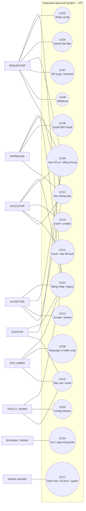
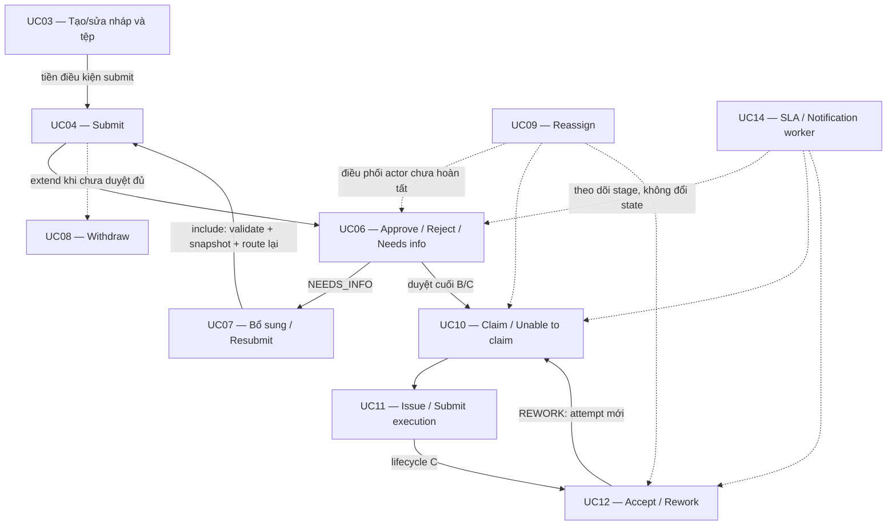
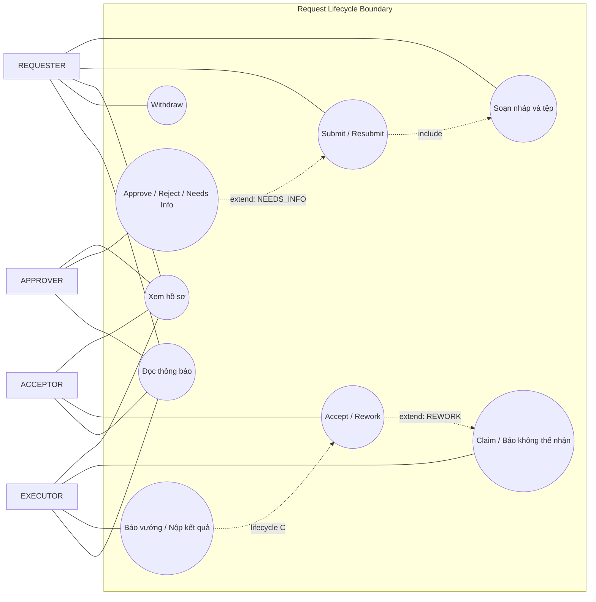
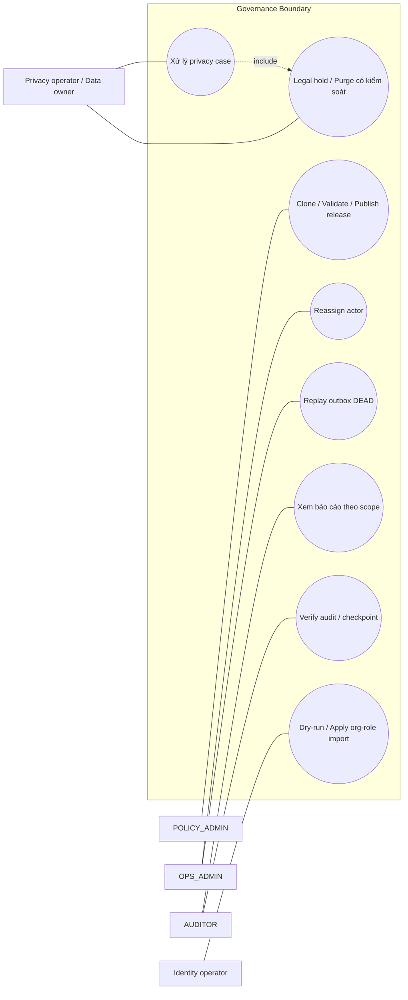
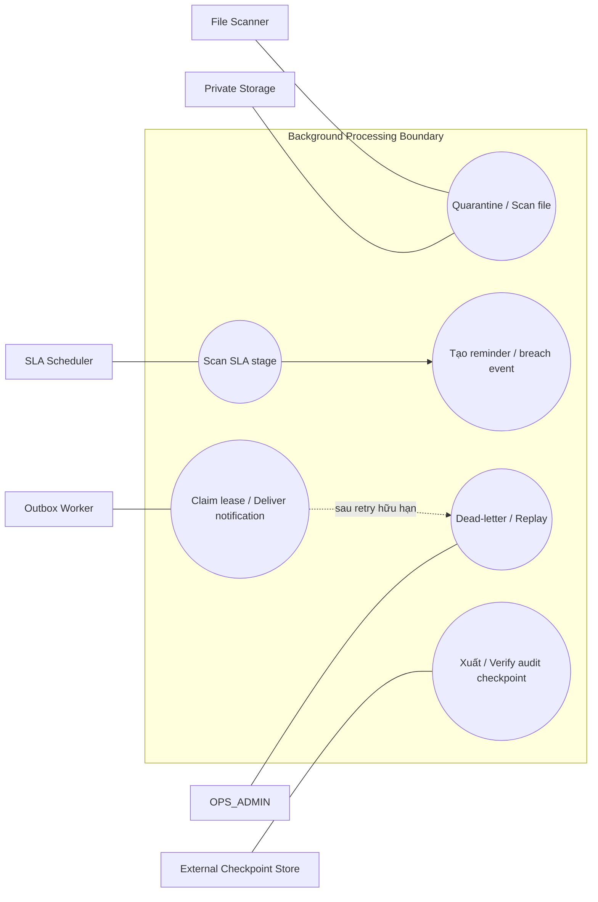
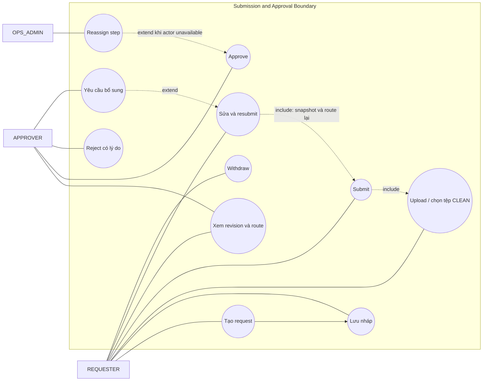
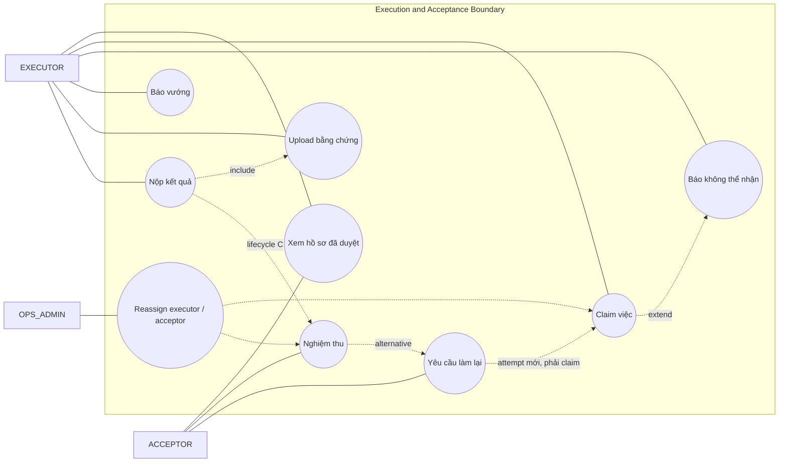
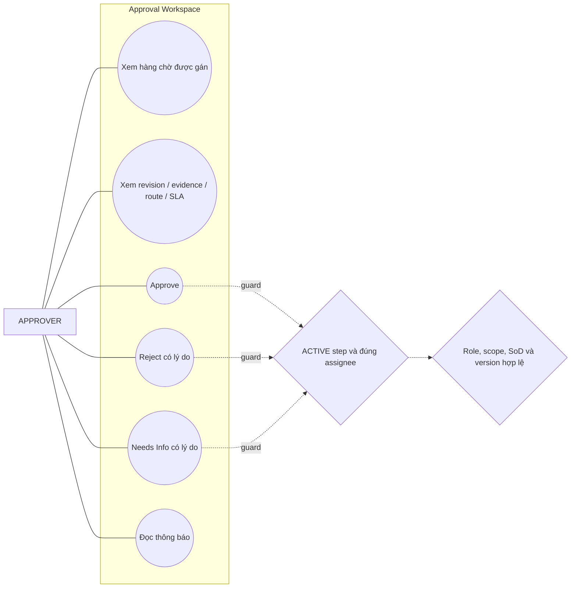
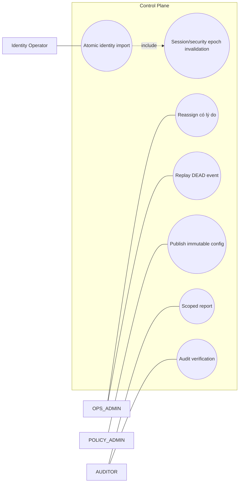

# Use-case model — EAS P0

**Model ID:** EAS-UCM-P0-01 · **Loại:** Target design P0 · **Nguồn:** SRS v2 mục 10
**Lưu ý:** Đây không phải mô tả ứng dụng đã triển khai; hiện mới có lớp database đáng kể.

## 1. UC-CTX-01 — System context

## 2. UC-REL-01 — Quan hệ nghiệp vụ giữa các use case

## 3. Ma trận actor–use case

`P` = primary actor; `S` = hỗ trợ/được đọc; `—` = không có quyền từ use case đó.

| UC | Requester | Approver | Executor | Acceptor | Policy | OPS | Auditor | System |
|---|:---:|:---:|:---:|:---:|:---:|:---:|:---:|:---:|
| UC01 Login/logout | P | P | P | P | P | P | P | — |
| UC02 Config release | — | — | — | — | P | — | S | — |
| UC03 Draft/attachment | P | — | — | — | — | — | — | scanner S |
| UC04 First submit | P | — | — | — | — | — | — | — |
| UC05 View/evidence | P* | P* | P* | P* | — | metadata | P* | — |
| UC06 Decision | — | P | — | — | — | — | — | — |
| UC07 Resubmit | P | — | — | — | — | — | — | — |
| UC08 Withdraw | P | — | — | — | — | — | — | — |
| UC09 Reassign | S | S | S | S | — | P | S | — |
| UC10 Claim/unable | — | — | P | — | — | S | — | — |
| UC11 Issue/result | — | — | P | — | — | S | — | — |
| UC12 Acceptance/rework | — | — | S | P | — | S | — | — |
| UC13 Notification | P* | P* | P* | P* | P* | P* | P* | worker S |
| UC14 SLA/delivery | — | — | — | — | — | S | S | P |
| UC15 Report/audit | S* | S* | S* | S* | admin-only | admin-only | P | — |
| UC17 Identity/org/role | — | — | — | — | — | — | S | identity P |

`*` luôn phụ thuộc active account và predicate owner/participant/role + type + department snapshot. Một người có thể giữ nhiều role nhưng SoD vẫn được kiểm độc lập.

## 4. Use-case contract rút gọn

| UC | Trigger | Tiền điều kiện chính | Thành công | Ngoại lệ bắt buộc thể hiện |
|---|---|---|---|---|
| UC01 | Gửi credential/logout | Account được cấp | Session rotate/hủy, CSRF hợp lệ | Generic 401, 429, idle/absolute expiry |
| UC02 | Publish release | POLICY đúng type/scope; DRAFT | Published bất biến, active swap nguyên tử | Config invalid; version conflict; actor chưa hợp lệ khi submit |
| UC03 | Save/upload/select file | REQUESTER đúng type/phòng | DRAFT/NEEDS_INFO tăng version | stale version; 413/415; scan không CLEAN; quota |
| UC04 | Submit | Nháp đầy đủ; viewed release hiện hành | Revision + instance + 1–3 step + SLA | config changed; route/SoD; audit/outbox fail rollback |
| UC05 | List/detail/download | Active và owner/participant/auditor đúng scope | Chỉ dữ liệu được phép, download audit | 404 anti-enumeration; OPS chỉ metadata |
| UC06 | Quyết định step | ACTIVE step, đúng assignee | Next step hoặc trạng thái cuối đúng A/B/C | reason; assignee unavailable; 403/409/replay |
| UC07 | Resubmit | NEEDS_INFO | Revision/instance/route mới | release đổi; route/amount đổi; không tái dùng decision cũ |
| UC08 | Withdraw | Owner; trước duyệt đủ | CANCELLED + steps còn lại SKIPPED | Race với final approval; terminal không reopen |
| UC09 | Reassign | OPS đúng scope + reason | Actor mới, history giữ nguyên | target immutable; SoD/role/scope invalid |
| UC10 | Claim/unable | Attempt READY, đúng executor | RUNNING/IN_PROGRESS hoặc issue | two claims; wrong actor; issue không reset SLA |
| UC11 | Submit result | Attempt RUNNING | B completed; C waiting acceptance | tệp/owner sai; blocked không giả completion |
| UC12 | Accept/rework | C, attempt SUBMITTED, đúng acceptor | Completed hoặc attempt READY mới | acceptor=executor; repeat; planned executor unavailable |
| UC13 | Read notification | Recipient hiện tại | `read_at` đặt một lần | người khác 404; link kiểm quyền lại |
| UC14 | Scheduler/worker tick | Stage/outbox hợp lệ | Reminder/breach/delivery dedupe | stale lease; retry 1/5/15; DEAD + replay |
| UC15 | Query/verify | Đúng kênh và scope | Aggregate đúng mẫu số; PASS/FAIL/UNKNOWN | zero denominator; gap/checkpoint thiếu |
| UC17 | Dry-run/apply import | File đã duyệt; operator định danh | Một transaction + security epoch + audit | bất kỳ dòng lỗi → không apply phần |

## 5. Quy tắc review

- UC16 cố ý không có trong P0: trong nguồn cũ nó là AI/P1; không tái sử dụng ID cho chức năng khác.
- UC02/UC09/UC17 không trao quyền đọc payload request.
- UC14 không được approve, reassign hoặc thay đổi request status.
- Mọi use case ghi phải liên kết tới sequence tương ứng và test trong RTM.

## 6. UC-BIZ-01 — Use case nghiệp vụ lõi theo actor

## 7. UC-ADM-01 — Quản trị và quản trị dữ liệu

`Privacy operator` là actor đặc quyền vận hành/pháp lý, chưa được formalize thành end-user role trong SRS; phải đóng KD06 và threat model trước production.

## 8. UC-SYS-01 — Tác vụ nền và hệ thống ngoài

## 9. UC-BIZ-02 — Khởi tạo, gửi và quyết định yêu cầu

## 10. UC-BIZ-03 — Thực hiện và nghiệm thu

## 11. UC-APR-01 — Góc nhìn Approver

## 12. UC-CTL-01 — Góc nhìn kiểm soát nội bộ

