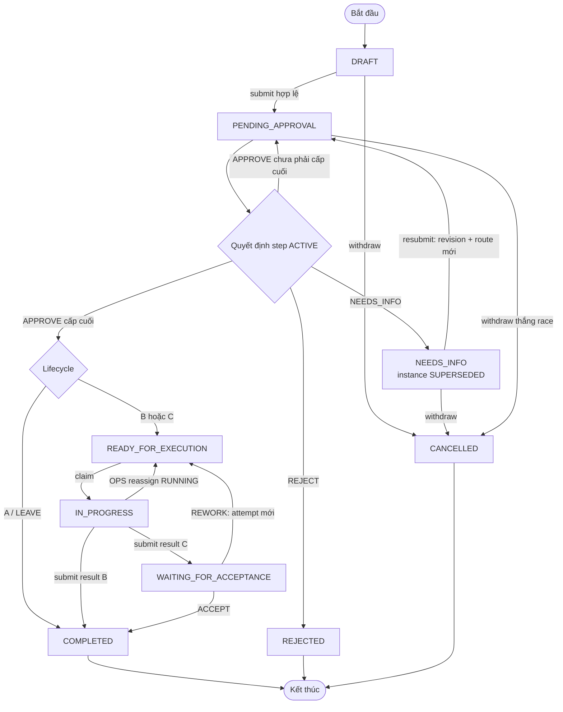
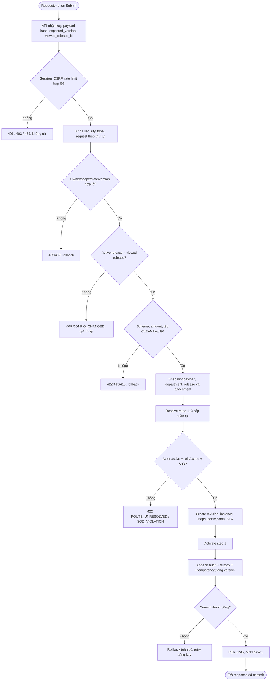
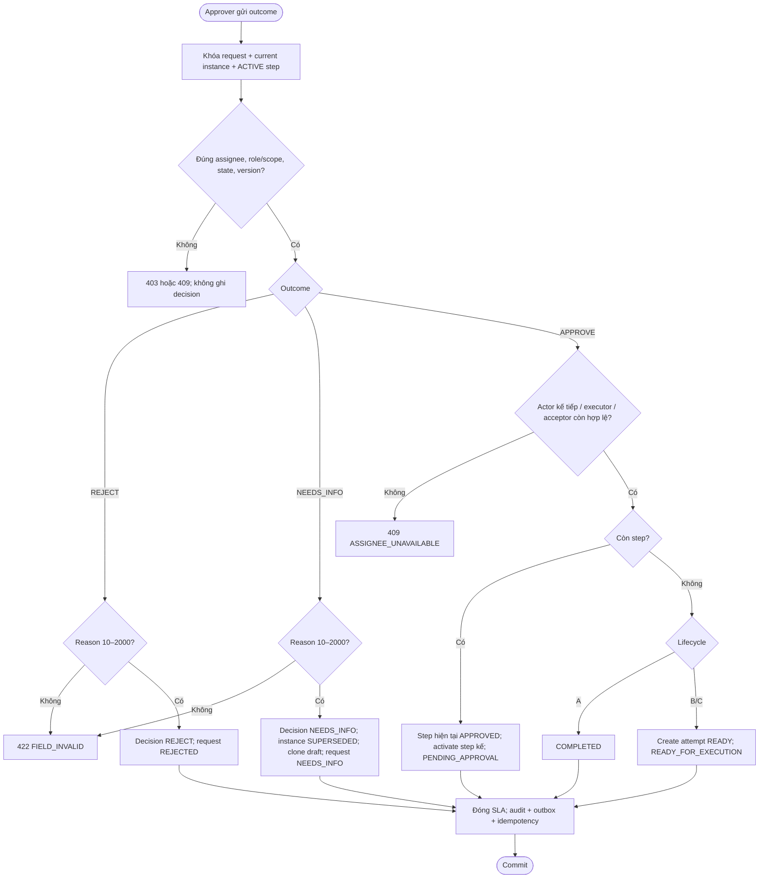
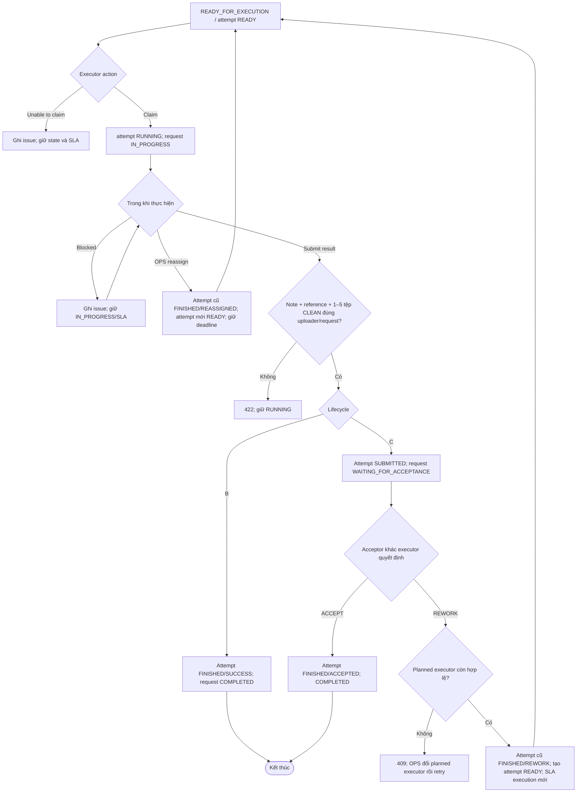
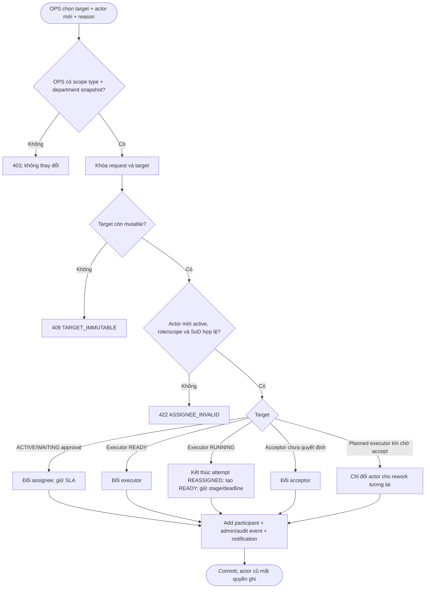
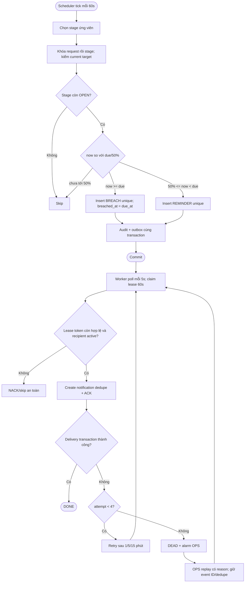
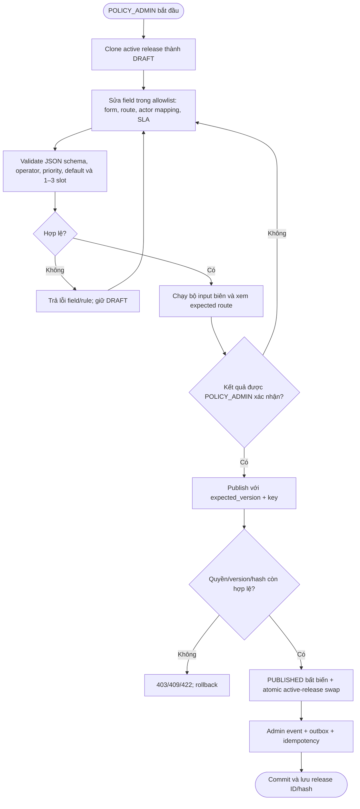
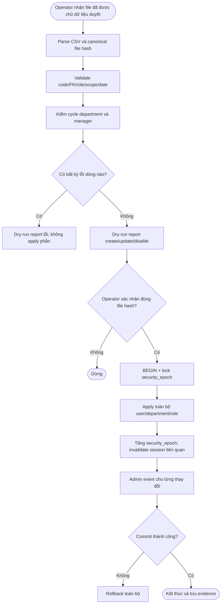
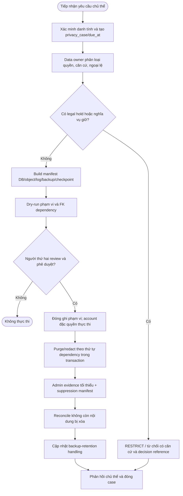
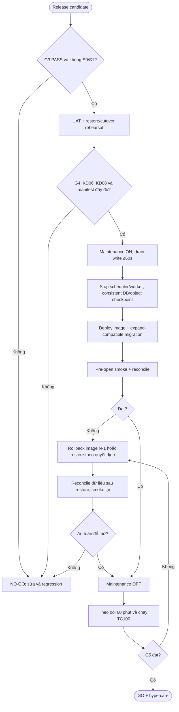

# Activity diagrams — EAS P0

**Loại:** Target design P0 · **Nguồn:** SRS/SDD v2 + schema v2.0.1
Các activity dưới mô tả business flow. Chi tiết call/transaction nằm trong sequence diagrams.

## AD-01 — Vòng đời tổng thể A/B/C

Không có cạnh rời trạng thái terminal. Không có `AUTO_APPROVED`, `EXECUTED` hay `EXECUTION_REJECTED`.

## AD-02 — Submit và resubmit

## AD-03 — Quyết định duyệt

## AD-04 — Thực hiện và nghiệm thu

## AD-05 — Reassign có kiểm soát

## AD-06 — SLA, outbox và notification

## Mapping sang kiểm thử

| Activity | Test trọng yếu |
|---|---|
| AD-01 | TC031–038, TC043–055, TC095, TC099 |
| AD-02 | TC013–030, TC033, TC056, TC094, TC097 |
| AD-03 | TC032–042, TC057–060 |
| AD-04 | TC043–055, TC064, TC070 |
| AD-05 | TC026, TC039–042, TC046, TC055, TC057 |
| AD-06 | TC061–070, TC082, TC087 |

## AD-07 — Soạn, validate và publish cấu hình

## AD-08 — Import danh tính, tổ chức và quyền

## AD-09 — Privacy case, legal hold và purge

## AD-10 — Go/No-Go, cutover và rollback

## Mapping bổ sung

| Activity | Test trọng yếu |
|---|---|
| AD-07 | TC010–012, TC029, TC075, TC097 |
| AD-08 | TC005–009, TC042, TC073 |
| AD-09 | TC083–085, TC089, TC096 |
| AD-10 | TC082, TC088–092, TC099–100 |

## Activity specification catalog

| ID | Trigger | Tiền điều kiện | Hậu điều kiện thành công | Ngoại lệ trọng yếu |
|---|---|---|---|---|
| AD-01 | Request được tạo | User/type active | Một terminal hợp lệ hoặc state đang xử lý | Không reopen terminal; lifecycle mismatch |
| AD-02 | Submit/resubmit | Draft đầy đủ, file CLEAN | Revision/instance/route/SLA nguyên tử | Config changed, route/SoD, rollback audit/outbox |
| AD-03 | Approver quyết định | ACTIVE step đúng assignee | Next step hoặc state cuối đúng lifecycle | Wrong actor/version, reason, assignee unavailable |
| AD-04 | Execution/acceptance action | Attempt current và actor hợp lệ | B completed; C accepted hoặc rework attempt mới | Cross-request file, double claim/accept, actor disabled |
| AD-05 | OPS reassign | Scope + reason + mutable target | Actor mới và history/audit đầy đủ | SoD/role/scope invalid, target immutable |
| AD-06 | Scheduler/worker tick | Open stage hoặc outbox event | Alert/notification tối đa một lần | Stale lease, retry exhausted, recipient disabled |
| AD-07 | POLICY publish | Valid DRAFT và test vectors | Immutable published release active | Invalid schema/rule/hash/version race |
| AD-08 | Identity apply | Approved file và successful dry-run | Atomic org/role update + epoch/audit | Any-row error, hierarchy cycle, partial apply |
| AD-09 | Approved privacy action | Verified subject/case/decision | Scoped purge/redact + suppression evidence | Legal hold, manifest drift, FK/object mismatch |
| AD-10 | Approved release window | G3/G4 và restore rehearsal | G5 or controlled rollback | Migration/smoke/reconcile/RPO-RTO failure |
