# Sequence diagrams — EAS P0

**Loại:** Target design P0, chưa phải AS-IS application
**Participant chuẩn:** Browser → Django API/domain → PostgreSQL, storage/scanner/worker chỉ xuất hiện khi cần.
**Transaction rule:** không gọi mạng khi đang giữ DB transaction, domain + audit + outbox + idempotency cùng commit/rollback.

## SD-01 — Đăng nhập, session và logout

**Trace:** UC01, FR01, NFR01 · **Tests:** TC001–006, TC071–072

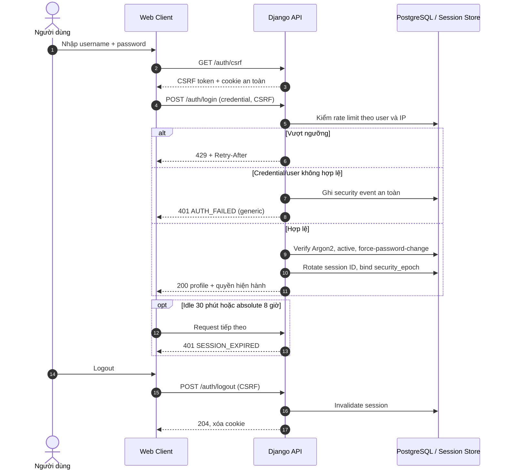
```mermaid
sequenceDiagram
    autonumber
    actor U as Người dùng
    participant W as Web Client
    participant A as Django API
    participant D as PostgreSQL / Session Store

    U->>W: Nhập username + password
    W->>A: GET /auth/csrf
    A-->>W: CSRF token + cookie an toàn
    W->>A: POST /auth/login (credential, CSRF)
    A->>D: Kiểm rate limit theo user và IP
    alt Vượt ngưỡng
        A-->>W: 429 + Retry-After
    else Credential/user không hợp lệ
        A->>D: Ghi security event an toàn
        A-->>W: 401 AUTH_FAILED (generic)
    else Hợp lệ
        A->>D: Verify Argon2, active, force-password-change
        A->>D: Rotate session ID, bind security_epoch
        A-->>W: 200 profile + quyền hiện hành
    end
    opt Idle 30 phút hoặc absolute 8 giờ
        W->>A: Request tiếp theo
        A-->>W: 401 SESSION_EXPIRED
    end
    U->>W: Logout
    W->>A: POST /auth/logout (CSRF)
    A->>D: Invalidate session
    A-->>W: 204, xóa cookie
```

## SD-02 — Upload, scan và chọn tệp

**Trace:** UC03, FR05, NFR09 · **Tests:** TC014–020, TC050, TC076, TC079

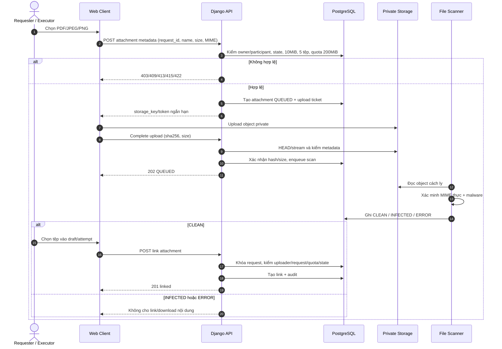
```mermaid
sequenceDiagram
    autonumber
    actor R as Requester / Executor
    participant W as Web Client
    participant A as Django API
    participant D as PostgreSQL
    participant S as Private Storage
    participant V as File Scanner

    R->>W: Chọn PDF/JPEG/PNG
    W->>A: POST attachment metadata (request_id, name, size, MIME)
    A->>D: Kiểm owner/participant, state, 10MiB, 5 tệp, quota 200MiB
    alt Không hợp lệ
        A-->>W: 403/409/413/415/422
    else Hợp lệ
        A->>D: Tạo attachment QUEUED + upload ticket
        A-->>W: storage_key/token ngắn hạn
        W->>S: Upload object private
        W->>A: Complete upload (sha256, size)
        A->>S: HEAD/stream và kiểm metadata
        A->>D: Xác nhận hash/size, enqueue scan
        A-->>W: 202 QUEUED
        V->>S: Đọc object cách ly
        V->>V: Xác minh MIME thực + malware
        V->>D: Ghi CLEAN / INFECTED / ERROR
        alt CLEAN
            R->>W: Chọn tệp vào draft/attempt
            W->>A: POST link attachment
            A->>D: Khóa request, kiểm uploader/request/quota/state
            A->>D: Tạo link + audit
            A-->>W: 201 linked
        else INFECTED hoặc ERROR
            A-->>W: Không cho link/download nội dung
        end
    end
```

## SD-03 — Submit/resubmit nguyên tử

**Trace:** UC04, UC07, FR06–09, BR01–08 · **Tests:** TC027–033, TC056, TC094, TC097

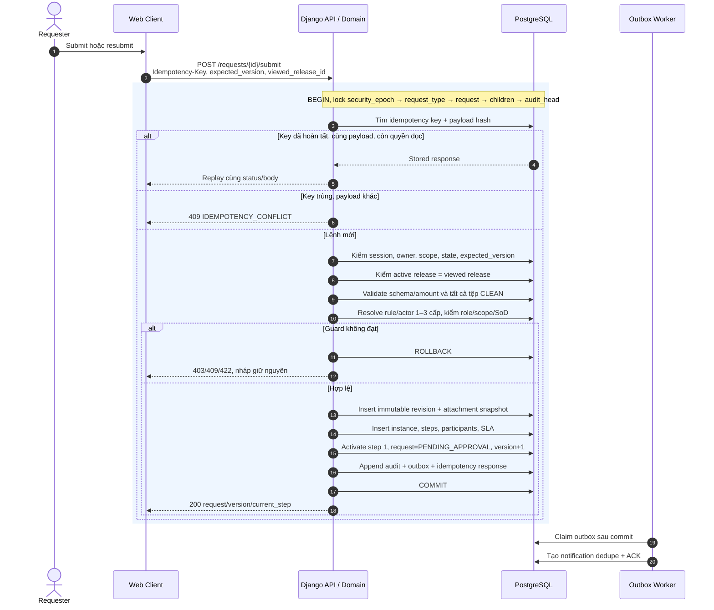
```mermaid
sequenceDiagram
    autonumber
    actor R as Requester
    participant W as Web Client
    participant A as Django API / Domain
    participant D as PostgreSQL
    participant O as Outbox Worker

    R->>W: Submit hoặc resubmit
    W->>A: POST /requests/{id}/submit<br/>Idempotency-Key, expected_version, viewed_release_id
    rect rgb(238, 246, 255)
        Note over A,D: BEGIN, lock security_epoch → request_type → request → children → audit_head
        A->>D: Tìm idempotency key + payload hash
        alt Key đã hoàn tất, cùng payload, còn quyền đọc
            D-->>A: Stored response
            A-->>W: Replay cùng status/body
        else Key trùng, payload khác
            A-->>W: 409 IDEMPOTENCY_CONFLICT
        else Lệnh mới
            A->>D: Kiểm session, owner, scope, state, expected_version
            A->>D: Kiểm active release = viewed release
            A->>D: Validate schema/amount và tất cả tệp CLEAN
            A->>D: Resolve rule/actor 1–3 cấp, kiểm role/scope/SoD
            alt Guard không đạt
                A->>D: ROLLBACK
                A-->>W: 403/409/422, nháp giữ nguyên
            else Hợp lệ
                A->>D: Insert immutable revision + attachment snapshot
                A->>D: Insert instance, steps, participants, SLA
                A->>D: Activate step 1, request=PENDING_APPROVAL, version+1
                A->>D: Append audit + outbox + idempotency response
                A->>D: COMMIT
                A-->>W: 200 request/version/current_step
            end
        end
    end
    O->>D: Claim outbox sau commit
    O->>D: Tạo notification dedupe + ACK
```

## SD-04 — Approve, reject và needs-info

**Trace:** UC06, UC07, FR07–09, BR02/05/07 · **Tests:** TC031–042, TC057–060

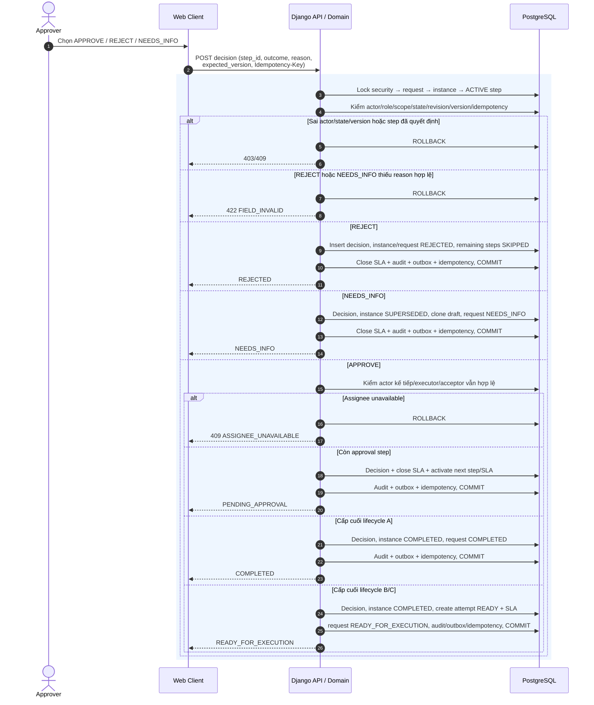
```mermaid
sequenceDiagram
    autonumber
    actor P as Approver
    participant W as Web Client
    participant A as Django API / Domain
    participant D as PostgreSQL

    P->>W: Chọn APPROVE / REJECT / NEEDS_INFO
    W->>A: POST decision (step_id, outcome, reason,<br/>expected_version, Idempotency-Key)
    rect rgb(238, 246, 255)
        A->>D: Lock security → request → instance → ACTIVE step
        A->>D: Kiểm actor/role/scope/state/revision/version/idempotency
        alt Sai actor/state/version hoặc step đã quyết định
            A->>D: ROLLBACK
            A-->>W: 403/409
        else REJECT hoặc NEEDS_INFO thiếu reason hợp lệ
            A->>D: ROLLBACK
            A-->>W: 422 FIELD_INVALID
        else REJECT
            A->>D: Insert decision, instance/request REJECTED, remaining steps SKIPPED
            A->>D: Close SLA + audit + outbox + idempotency, COMMIT
            A-->>W: REJECTED
        else NEEDS_INFO
            A->>D: Decision, instance SUPERSEDED, clone draft, request NEEDS_INFO
            A->>D: Close SLA + audit + outbox + idempotency, COMMIT
            A-->>W: NEEDS_INFO
        else APPROVE
            A->>D: Kiểm actor kế tiếp/executor/acceptor vẫn hợp lệ
            alt Assignee unavailable
                A->>D: ROLLBACK
                A-->>W: 409 ASSIGNEE_UNAVAILABLE
            else Còn approval step
                A->>D: Decision + close SLA + activate next step/SLA
                A->>D: Audit + outbox + idempotency, COMMIT
                A-->>W: PENDING_APPROVAL
            else Cấp cuối lifecycle A
                A->>D: Decision, instance COMPLETED, request COMPLETED
                A->>D: Audit + outbox + idempotency, COMMIT
                A-->>W: COMPLETED
            else Cấp cuối lifecycle B/C
                A->>D: Decision, instance COMPLETED, create attempt READY + SLA
                A->>D: request READY_FOR_EXECUTION, audit/outbox/idempotency, COMMIT
                A-->>W: READY_FOR_EXECUTION
            end
        end
    end
```

## SD-05 — Withdraw cạnh tranh approve cuối

**Trace:** UC08, FR10, NFR10 · **Tests:** TC037–038, TC057, TC060

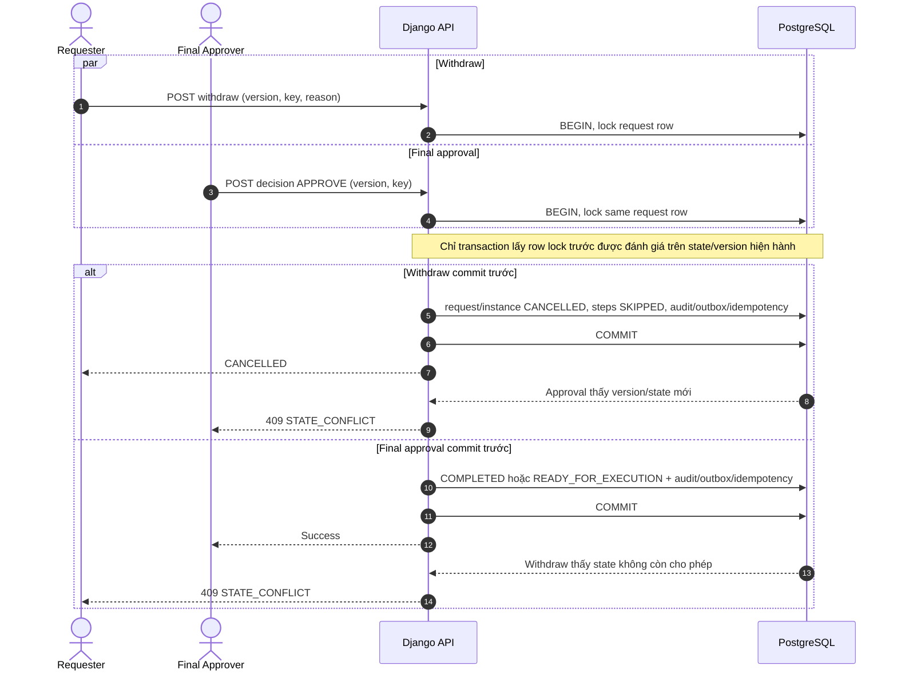
```mermaid
sequenceDiagram
    autonumber
    actor R as Requester
    actor P as Final Approver
    participant A as Django API
    participant D as PostgreSQL

    par Withdraw
        R->>A: POST withdraw (version, key, reason)
        A->>D: BEGIN, lock request row
    and Final approval
        P->>A: POST decision APPROVE (version, key)
        A->>D: BEGIN, lock same request row
    end
    Note over A,D: Chỉ transaction lấy row lock trước được đánh giá trên state/version hiện hành
    alt Withdraw commit trước
        A->>D: request/instance CANCELLED, steps SKIPPED, audit/outbox/idempotency
        A->>D: COMMIT
        A-->>R: CANCELLED
        D-->>A: Approval thấy version/state mới
        A-->>P: 409 STATE_CONFLICT
    else Final approval commit trước
        A->>D: COMPLETED hoặc READY_FOR_EXECUTION + audit/outbox/idempotency
        A->>D: COMMIT
        A-->>P: Success
        D-->>A: Withdraw thấy state không còn cho phép
        A-->>R: 409 STATE_CONFLICT
    end
```

## SD-06 — Claim, submit execution, accept/rework

**Trace:** UC10–UC12, FR12–13 · **Tests:** TC043–055

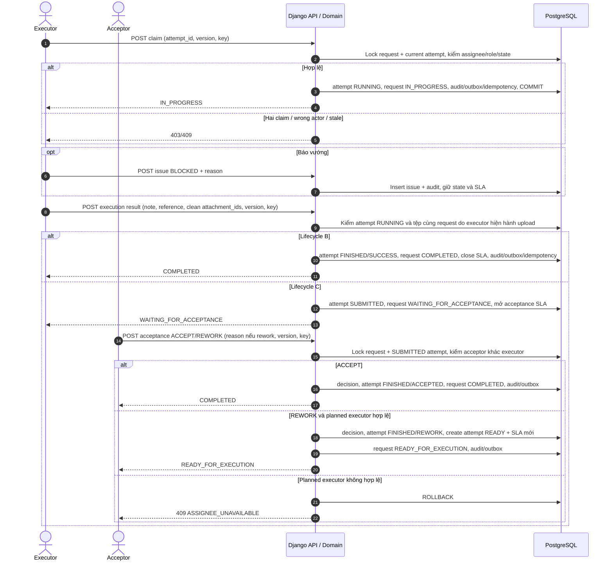
```mermaid
sequenceDiagram
    autonumber
    actor E as Executor
    actor C as Acceptor
    participant A as Django API / Domain
    participant D as PostgreSQL

    E->>A: POST claim (attempt_id, version, key)
    A->>D: Lock request + current attempt, kiểm assignee/role/state
    alt Hợp lệ
        A->>D: attempt RUNNING, request IN_PROGRESS, audit/outbox/idempotency, COMMIT
        A-->>E: IN_PROGRESS
    else Hai claim / wrong actor / stale
        A-->>E: 403/409
    end
    opt Báo vướng
        E->>A: POST issue BLOCKED + reason
        A->>D: Insert issue + audit, giữ state và SLA
    end
    E->>A: POST execution result (note, reference, clean attachment_ids, version, key)
    A->>D: Kiểm attempt RUNNING và tệp cùng request do executor hiện hành upload
    alt Lifecycle B
        A->>D: attempt FINISHED/SUCCESS, request COMPLETED, close SLA, audit/outbox/idempotency
        A-->>E: COMPLETED
    else Lifecycle C
        A->>D: attempt SUBMITTED, request WAITING_FOR_ACCEPTANCE, mở acceptance SLA
        A-->>E: WAITING_FOR_ACCEPTANCE
        C->>A: POST acceptance ACCEPT/REWORK (reason nếu rework, version, key)
        A->>D: Lock request + SUBMITTED attempt, kiểm acceptor khác executor
        alt ACCEPT
            A->>D: decision, attempt FINISHED/ACCEPTED, request COMPLETED, audit/outbox
            A-->>C: COMPLETED
        else REWORK và planned executor hợp lệ
            A->>D: decision, attempt FINISHED/REWORK, create attempt READY + SLA mới
            A->>D: request READY_FOR_EXECUTION, audit/outbox
            A-->>C: READY_FOR_EXECUTION
        else Planned executor không hợp lệ
            A->>D: ROLLBACK
            A-->>C: 409 ASSIGNEE_UNAVAILABLE
        end
    end
```

## SD-07 — Reassign khi executor đang chạy

**Trace:** UC09, BR09–10 · **Tests:** TC039–040, TC046, TC055, TC057

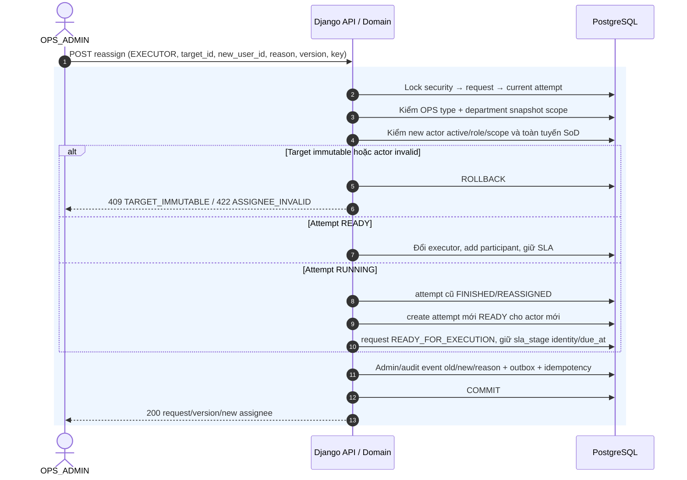
```mermaid
sequenceDiagram
    autonumber
    actor O as OPS_ADMIN
    participant A as Django API / Domain
    participant D as PostgreSQL

    O->>A: POST reassign (EXECUTOR, target_id, new_user_id, reason, version, key)
    rect rgb(238, 246, 255)
        A->>D: Lock security → request → current attempt
        A->>D: Kiểm OPS type + department snapshot scope
        A->>D: Kiểm new actor active/role/scope và toàn tuyến SoD
        alt Target immutable hoặc actor invalid
            A->>D: ROLLBACK
            A-->>O: 409 TARGET_IMMUTABLE / 422 ASSIGNEE_INVALID
        else Attempt READY
            A->>D: Đổi executor, add participant, giữ SLA
        else Attempt RUNNING
            A->>D: attempt cũ FINISHED/REASSIGNED
            A->>D: create attempt mới READY cho actor mới
            A->>D: request READY_FOR_EXECUTION, giữ sla_stage identity/due_at
        end
        A->>D: Admin/audit event old/new/reason + outbox + idempotency
        A->>D: COMMIT
        A-->>O: 200 request/version/new assignee
    end
```

## SD-08 — SLA/outbox lease, retry và replay

**Trace:** UC14, FR14–15, NFR04 · **Tests:** TC061–070, TC087

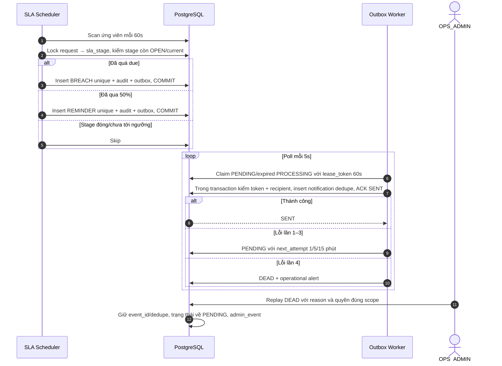
```mermaid
sequenceDiagram
    autonumber
    participant S as SLA Scheduler
    participant D as PostgreSQL
    participant W as Outbox Worker
    actor O as OPS_ADMIN

    S->>D: Scan ứng viên mỗi 60s
    S->>D: Lock request → sla_stage, kiểm stage còn OPEN/current
    alt Đã quá due
        S->>D: Insert BREACH unique + audit + outbox, COMMIT
    else Đã qua 50%
        S->>D: Insert REMINDER unique + audit + outbox, COMMIT
    else Stage đóng/chưa tới ngưỡng
        S->>D: Skip
    end
    loop Poll mỗi 5s
        W->>D: Claim PENDING/expired PROCESSING với lease_token 60s
        W->>D: Trong transaction kiểm token + recipient, insert notification dedupe, ACK SENT
        alt Thành công
            D-->>W: SENT
        else Lỗi lần 1–3
            W->>D: PENDING với next_attempt 1/5/15 phút
        else Lỗi lần 4
            W->>D: DEAD + operational alert
        end
    end
    O->>D: Replay DEAD với reason và quyền đúng scope
    D->>D: Giữ event_id/dedupe, trạng thái về PENDING, admin_event
```

## SD-09 — Publish config release

**Trace:** UC02, FR03/17/18 · **Tests:** TC010–012, TC029, TC075, TC097

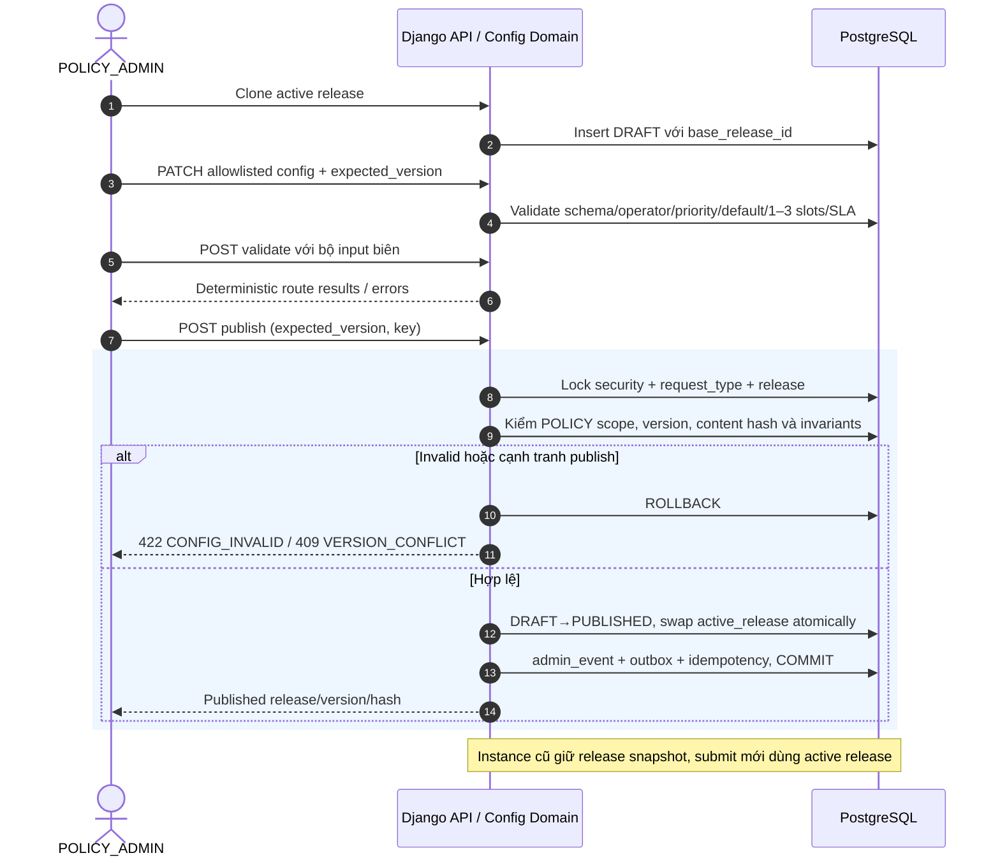
```mermaid
sequenceDiagram
    autonumber
    actor P as POLICY_ADMIN
    participant A as Django API / Config Domain
    participant D as PostgreSQL

    P->>A: Clone active release
    A->>D: Insert DRAFT với base_release_id
    P->>A: PATCH allowlisted config + expected_version
    A->>D: Validate schema/operator/priority/default/1–3 slots/SLA
    P->>A: POST validate với bộ input biên
    A-->>P: Deterministic route results / errors
    P->>A: POST publish (expected_version, key)
    rect rgb(238, 246, 255)
        A->>D: Lock security + request_type + release
        A->>D: Kiểm POLICY scope, version, content hash và invariants
        alt Invalid hoặc cạnh tranh publish
            A->>D: ROLLBACK
            A-->>P: 422 CONFIG_INVALID / 409 VERSION_CONFLICT
        else Hợp lệ
            A->>D: DRAFT→PUBLISHED, swap active_release atomically
            A->>D: admin_event + outbox + idempotency, COMMIT
            A-->>P: Published release/version/hash
        end
    end
    Note over A,D: Instance cũ giữ release snapshot, submit mới dùng active release
```

## SD-10 — Đọc chi tiết/tệp chống IDOR

**Trace:** UC05, NFR02 · **Tests:** TC023–026, TC068–069

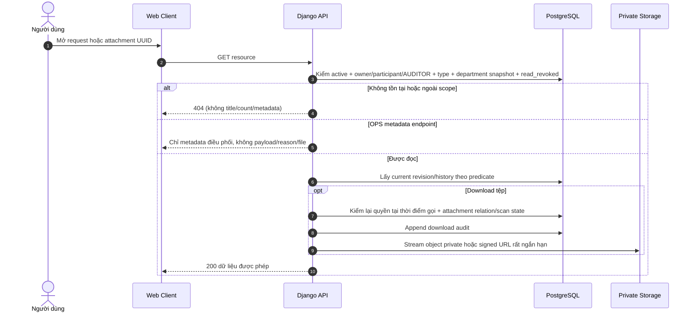
```mermaid
sequenceDiagram
    autonumber
    actor U as Người dùng
    participant W as Web Client
    participant A as Django API
    participant D as PostgreSQL
    participant S as Private Storage

    U->>W: Mở request hoặc attachment UUID
    W->>A: GET resource
    A->>D: Kiểm active + owner/participant/AUDITOR + type + department snapshot + read_revoked
    alt Không tồn tại hoặc ngoài scope
        A-->>W: 404 (không title/count/metadata)
    else OPS metadata endpoint
        A-->>W: Chỉ metadata điều phối, không payload/reason/file
    else Được đọc
        A->>D: Lấy current revision/history theo predicate
        opt Download tệp
            A->>D: Kiểm lại quyền tại thời điểm gọi + attachment relation/scan state
            A->>D: Append download audit
            A->>S: Stream object private hoặc signed URL rất ngắn hạn
        end
        A-->>W: 200 dữ liệu được phép
    end
```

## Quy tắc mở rộng sequence

Khi bổ sung một command mới, sao mẫu SD-03/SD-04 và giữ đủ sáu lớp kiểm soát: authentication/CSRF → authorization/scope → state/version → idempotency → atomic domain/audit/outbox → post-commit delivery. Nhánh lỗi phải trả mã xác định và chứng minh không có side effect.

## SD-11 — Import danh tính và thu hồi session

**Trace:** UC17, FR01–02, BR12 · **Tests:** TC005–009, TC042, TC073

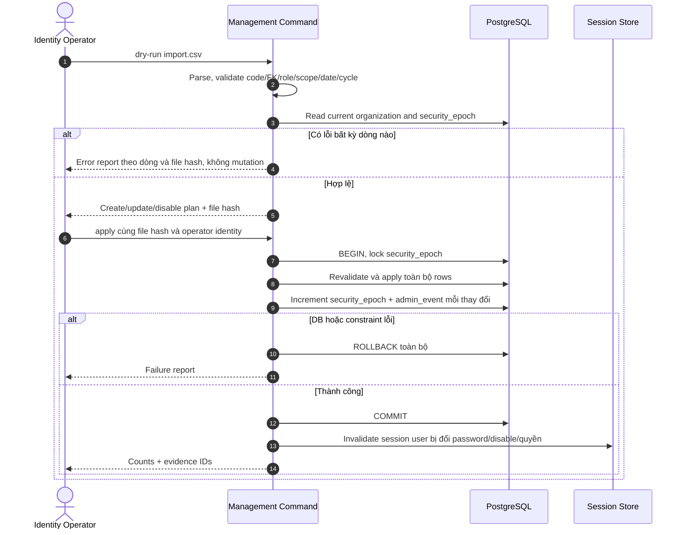
```mermaid
sequenceDiagram
    autonumber
    actor I as Identity Operator
    participant C as Management Command
    participant D as PostgreSQL
    participant S as Session Store

    I->>C: dry-run import.csv
    C->>C: Parse, validate code/FK/role/scope/date/cycle
    C->>D: Read current organization and security_epoch
    alt Có lỗi bất kỳ dòng nào
        C-->>I: Error report theo dòng và file hash, không mutation
    else Hợp lệ
        C-->>I: Create/update/disable plan + file hash
        I->>C: apply cùng file hash và operator identity
        C->>D: BEGIN, lock security_epoch
        C->>D: Revalidate và apply toàn bộ rows
        C->>D: Increment security_epoch + admin_event mỗi thay đổi
        alt DB hoặc constraint lỗi
            C->>D: ROLLBACK toàn bộ
            C-->>I: Failure report
        else Thành công
            C->>D: COMMIT
            C->>S: Invalidate session user bị đổi password/disable/quyền
            C-->>I: Counts + evidence IDs
        end
    end
```

## SD-12 — Thu hồi quyền cạnh tranh approve

**Trace:** BR12, UC06, UC17 · **Tests:** TC005, TC042, TC058

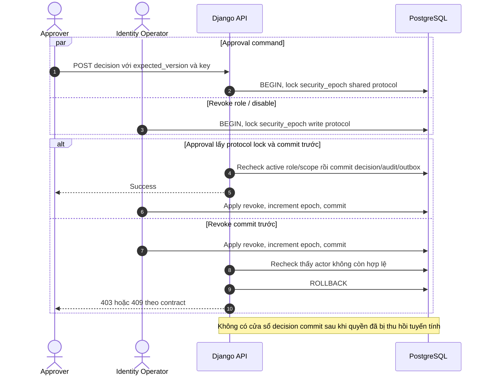
```mermaid
sequenceDiagram
    autonumber
    actor P as Approver
    actor I as Identity Operator
    participant A as Django API
    participant D as PostgreSQL

    par Approval command
        P->>A: POST decision với expected_version và key
        A->>D: BEGIN, lock security_epoch shared protocol
    and Revoke role / disable
        I->>D: BEGIN, lock security_epoch write protocol
    end
    alt Approval lấy protocol lock và commit trước
        A->>D: Recheck active role/scope rồi commit decision/audit/outbox
        A-->>P: Success
        I->>D: Apply revoke, increment epoch, commit
    else Revoke commit trước
        I->>D: Apply revoke, increment epoch, commit
        A->>D: Recheck thấy actor không còn hợp lệ
        A->>D: ROLLBACK
        A-->>P: 403 hoặc 409 theo contract
    end
    Note over A,D: Không có cửa sổ decision commit sau khi quyền đã bị thu hồi tuyến tính
```

## SD-13 — Append audit và verify checkpoint

**Trace:** UC15, FR17, BR14 · **Tests:** TC028, TC082, TC096

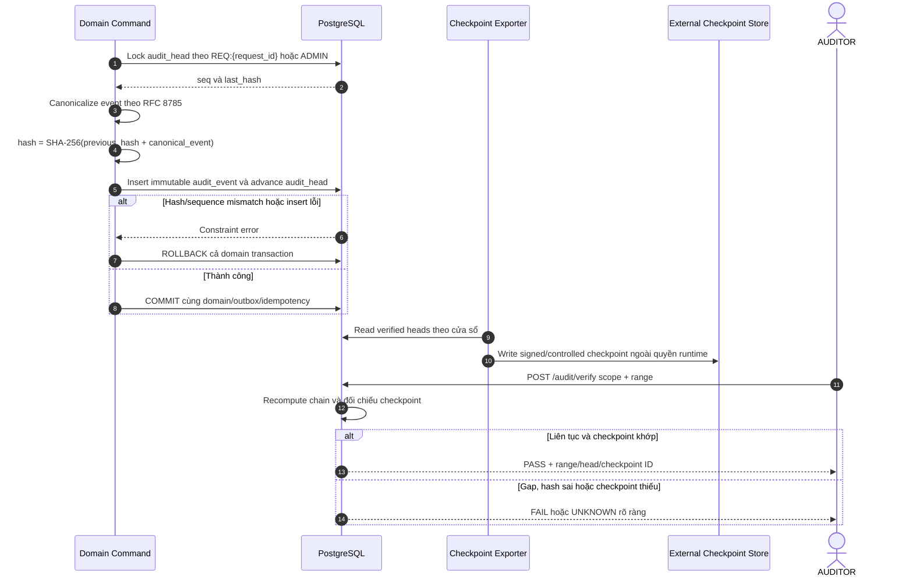
```mermaid
sequenceDiagram
    autonumber
    participant A as Domain Command
    participant D as PostgreSQL
    participant C as Checkpoint Exporter
    participant X as External Checkpoint Store
    actor U as AUDITOR

    A->>D: Lock audit_head theo REQ:{request_id} hoặc ADMIN
    D-->>A: seq và last_hash
    A->>A: Canonicalize event theo RFC 8785
    A->>A: hash = SHA-256(previous_hash + canonical_event)
    A->>D: Insert immutable audit_event và advance audit_head
    alt Hash/sequence mismatch hoặc insert lỗi
        D-->>A: Constraint error
        A->>D: ROLLBACK cả domain transaction
    else Thành công
        A->>D: COMMIT cùng domain/outbox/idempotency
    end
    C->>D: Read verified heads theo cửa sổ
    C->>X: Write signed/controlled checkpoint ngoài quyền runtime
    U->>D: POST /audit/verify scope + range
    D->>D: Recompute chain và đối chiếu checkpoint
    alt Liên tục và checkpoint khớp
        D-->>U: PASS + range/head/checkpoint ID
    else Gap, hash sai hoặc checkpoint thiếu
        D-->>U: FAIL hoặc UNKNOWN rõ ràng
    end
```

## SD-14 — Privacy purge có legal hold

**Trace:** KD06, privacy process tài liệu 05 · **Tests:** TC083–085, TC089

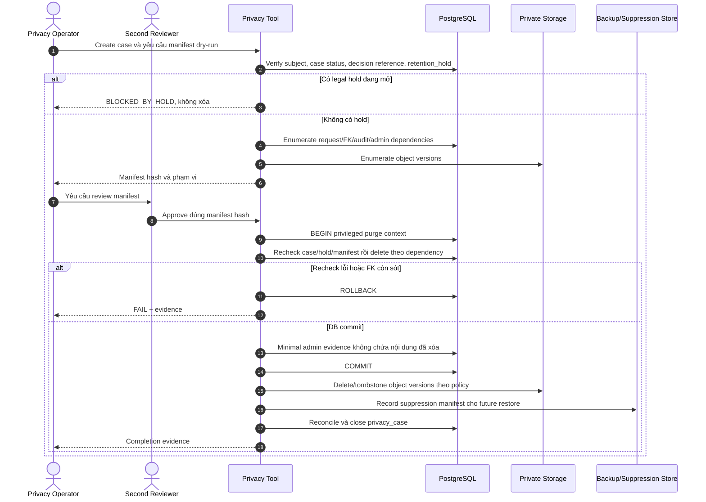
```mermaid
sequenceDiagram
    autonumber
    actor O as Privacy Operator
    actor R as Second Reviewer
    participant P as Privacy Tool
    participant D as PostgreSQL
    participant S as Private Storage
    participant B as Backup/Suppression Store

    O->>P: Create case và yêu cầu manifest dry-run
    P->>D: Verify subject, case status, decision reference, retention_hold
    alt Có legal hold đang mở
        P-->>O: BLOCKED_BY_HOLD, không xóa
    else Không có hold
        P->>D: Enumerate request/FK/audit/admin dependencies
        P->>S: Enumerate object versions
        P-->>O: Manifest hash và phạm vi
        O->>R: Yêu cầu review manifest
        R->>P: Approve đúng manifest hash
        P->>D: BEGIN privileged purge context
        P->>D: Recheck case/hold/manifest rồi delete theo dependency
        alt Recheck lỗi hoặc FK còn sót
            P->>D: ROLLBACK
            P-->>O: FAIL + evidence
        else DB commit
            P->>D: Minimal admin evidence không chứa nội dung đã xóa
            P->>D: COMMIT
            P->>S: Delete/tombstone object versions theo policy
            P->>B: Record suppression manifest cho future restore
            P->>D: Reconcile và close privacy_case
            P-->>O: Completion evidence
        end
    end
```

## SD-15 — Đọc và đánh dấu notification

**Trace:** UC13, FR14, NFR02 · **Tests:** TC068–069

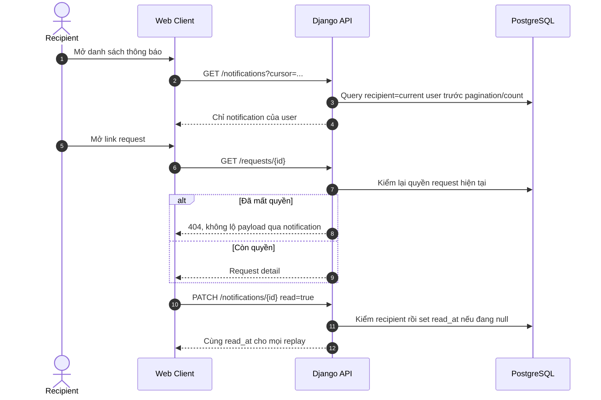
```mermaid
sequenceDiagram
    autonumber
    actor U as Recipient
    participant W as Web Client
    participant A as Django API
    participant D as PostgreSQL

    U->>W: Mở danh sách thông báo
    W->>A: GET /notifications?cursor=...
    A->>D: Query recipient=current user trước pagination/count
    A-->>W: Chỉ notification của user
    U->>W: Mở link request
    W->>A: GET /requests/{id}
    A->>D: Kiểm lại quyền request hiện tại
    alt Đã mất quyền
        A-->>W: 404, không lộ payload qua notification
    else Còn quyền
        A-->>W: Request detail
    end
    W->>A: PATCH /notifications/{id} read=true
    A->>D: Kiểm recipient rồi set read_at nếu đang null
    A-->>W: Cùng read_at cho mọi replay
```

## SD-16 — Báo cáo theo scope và mẫu số

**Trace:** UC15, FR16/19 · **Tests:** TC023–026, TC093

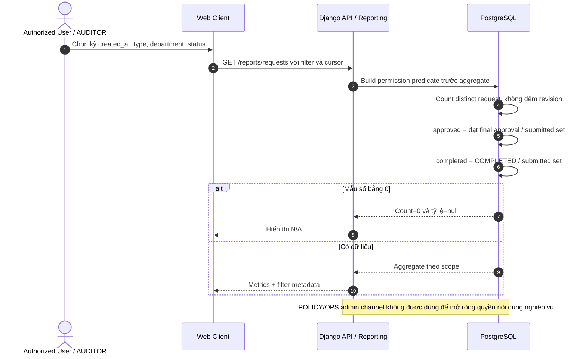
```mermaid
sequenceDiagram
    autonumber
    actor U as Authorized User / AUDITOR
    participant W as Web Client
    participant A as Django API / Reporting
    participant D as PostgreSQL

    U->>W: Chọn kỳ created_at, type, department, status
    W->>A: GET /reports/requests với filter và cursor
    A->>D: Build permission predicate trước aggregate
    D->>D: Count distinct request, không đếm revision
    D->>D: approved = đạt final approval / submitted set
    D->>D: completed = COMPLETED / submitted set
    alt Mẫu số bằng 0
        D-->>A: Count=0 và tỷ lệ=null
        A-->>W: Hiển thị N/A
    else Có dữ liệu
        D-->>A: Aggregate theo scope
        A-->>W: Metrics + filter metadata
    end
    Note over A,D: POLICY/OPS admin channel không được dùng để mở rộng quyền nội dung nghiệp vụ
```

## SD-17 — Cutover và rollback có kiểm soát

**Trace:** Tài liệu 05 RB01–RB05 · **Tests:** TC088–092, TC100

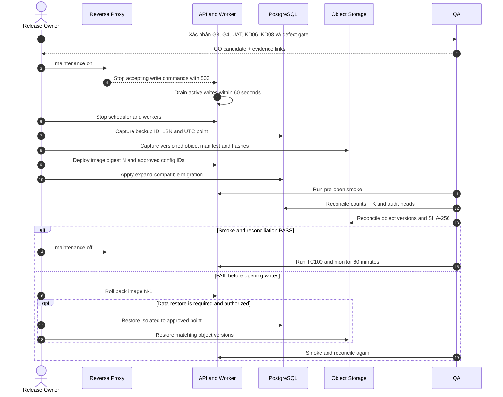
```mermaid
sequenceDiagram
    autonumber
    actor R as Release Owner
    participant P as Reverse Proxy
    participant A as API and Worker
    participant D as PostgreSQL
    participant O as Object Storage
    participant Q as QA

    R->>Q: Xác nhận G3, G4, UAT, KD06, KD08 và defect gate
    Q-->>R: GO candidate + evidence links
    R->>P: maintenance on
    P-->>A: Stop accepting write commands with 503
    A->>A: Drain active writes within 60 seconds
    R->>A: Stop scheduler and workers
    R->>D: Capture backup ID, LSN and UTC point
    R->>O: Capture versioned object manifest and hashes
    R->>A: Deploy image digest N and approved config IDs
    R->>D: Apply expand-compatible migration
    Q->>A: Run pre-open smoke
    Q->>D: Reconcile counts, FK and audit heads
    Q->>O: Reconcile object versions and SHA-256
    alt Smoke and reconciliation PASS
        R->>P: maintenance off
        Q->>A: Run TC100 and monitor 60 minutes
    else FAIL before opening writes
        R->>A: Roll back image N-1
        opt Data restore is required and authorized
            R->>D: Restore isolated to approved point
            R->>O: Restore matching object versions
        end
        Q->>A: Smoke and reconcile again
    end
```

## SD-18 — Point-in-time restore và đối soát

**Trace:** NFR05, tài liệu 05 RB05 · **Tests:** TC089–091

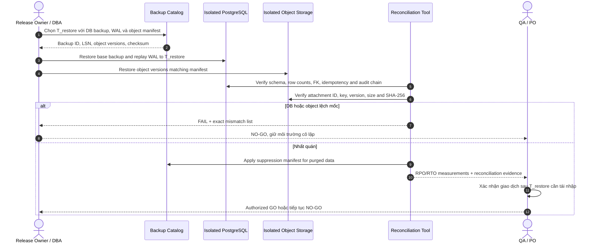
```mermaid
sequenceDiagram
    autonumber
    actor O as Release Owner / DBA
    participant B as Backup Catalog
    participant D as Isolated PostgreSQL
    participant S as Isolated Object Storage
    participant V as Reconciliation Tool
    actor Q as QA / PO

    O->>B: Chọn T_restore với DB backup, WAL và object manifest
    B-->>O: Backup ID, LSN, object versions, checksum
    O->>D: Restore base backup and replay WAL to T_restore
    O->>S: Restore object versions matching manifest
    V->>D: Verify schema, row counts, FK, idempotency and audit chain
    V->>S: Verify attachment ID, key, version, size and SHA-256
    alt DB hoặc object lệch mốc
        V-->>O: FAIL + exact mismatch list
        O-->>Q: NO-GO, giữ môi trường cô lập
    else Nhất quán
        V->>B: Apply suppression manifest for purged data
        V-->>Q: RPO/RTO measurements + reconciliation evidence
        Q->>Q: Xác nhận giao dịch sau T_restore cần tái nhập
        Q-->>O: Authorized GO hoặc tiếp tục NO-GO
    end
```

## SD-19 — Lưu nháp chống ghi đè

**Trace:** UC03, FR04, NFR10 · **Tests:** TC013, TC021–022

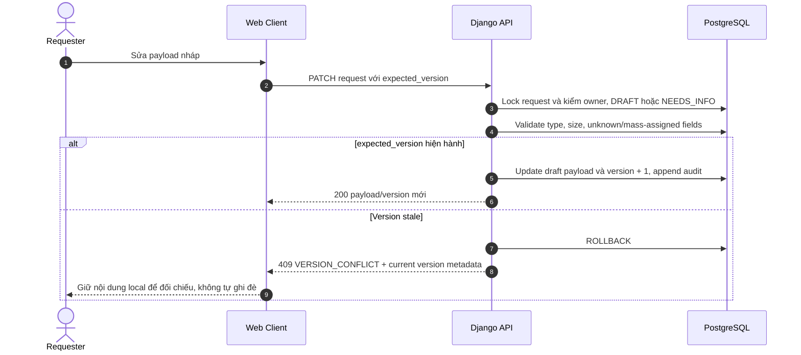
```mermaid
sequenceDiagram
    autonumber
    actor R as Requester
    participant W as Web Client
    participant A as Django API
    participant D as PostgreSQL

    R->>W: Sửa payload nháp
    W->>A: PATCH request với expected_version
    A->>D: Lock request và kiểm owner, DRAFT hoặc NEEDS_INFO
    A->>D: Validate type, size, unknown/mass-assigned fields
    alt expected_version hiện hành
        A->>D: Update draft payload và version + 1, append audit
        A-->>W: 200 payload/version mới
    else Version stale
        A->>D: ROLLBACK
        A-->>W: 409 VERSION_CONFLICT + current version metadata
        W-->>R: Giữ nội dung local để đối chiếu, không tự ghi đè
    end
```

## SD-20 — Needs Info và resubmit từ đầu

**Trace:** UC06–07, BR06 · **Tests:** TC029, TC031, TC036

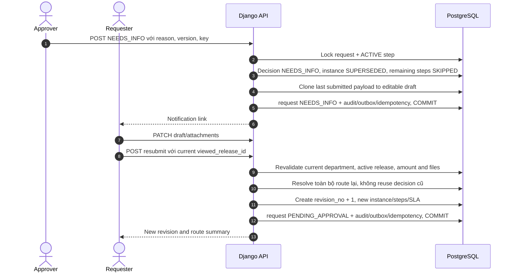
```mermaid
sequenceDiagram
    autonumber
    actor P as Approver
    actor R as Requester
    participant A as Django API
    participant D as PostgreSQL

    P->>A: POST NEEDS_INFO với reason, version, key
    A->>D: Lock request + ACTIVE step
    A->>D: Decision NEEDS_INFO, instance SUPERSEDED, remaining steps SKIPPED
    A->>D: Clone last submitted payload to editable draft
    A->>D: request NEEDS_INFO + audit/outbox/idempotency, COMMIT
    A-->>R: Notification link
    R->>A: PATCH draft/attachments
    R->>A: POST resubmit với current viewed_release_id
    A->>D: Revalidate current department, active release, amount and files
    A->>D: Resolve toàn bộ route lại, không reuse decision cũ
    A->>D: Create revision_no + 1, new instance/steps/SLA
    A->>D: request PENDING_APPROVAL + audit/outbox/idempotency, COMMIT
    A-->>R: New revision and route summary
```

## SD-21 — Unable to claim và blocked issue

**Trace:** UC10–11, FR12/15 · **Tests:** TC043, TC049

```mermaid
sequenceDiagram
    autonumber
    actor E as Executor
    participant A as Django API
    participant D as PostgreSQL
    actor O as OPS_ADMIN

    alt Không thể nhận attempt READY
        E->>A: POST issue UNABLE_TO_CLAIM + reason
        A->>D: Kiểm current assignee và state READY
        A->>D: Insert issue + audit/outbox, giữ READY_FOR_EXECUTION và due_at
        A-->>O: In-app notification để điều phối
    else Bị vướng khi attempt RUNNING
        E->>A: POST issue BLOCKED + reason
        A->>D: Kiểm executor hiện hành và state RUNNING
        A->>D: Insert issue + audit/outbox, giữ IN_PROGRESS và due_at
        A-->>O: In-app notification để điều phối
    end
    Note over A,D: Issue không tự reassign, không dừng hoặc reset SLA
```

## SD-22 — Reassign approver hoặc acceptor

**Trace:** UC09, BR02/09/10 · **Tests:** TC039–041, TC051, TC057

```mermaid
sequenceDiagram
    autonumber
    actor O as OPS_ADMIN
    participant A as Django API
    participant D as PostgreSQL

    O->>A: POST reassign target + new_user + reason + version + key
    A->>D: Lock security, request, current target
    A->>D: Check OPS scope and target mutability
    A->>D: Check new actor active, role, type, department and full-route SoD
    alt Approval step ACTIVE or WAITING
        A->>D: Update assignee, preserve SLA identity/deadline
    else Acceptor before decision
        A->>D: Update instance acceptor and participant
    else Planned executor while waiting acceptance
        A->>D: Update planned executor only for future rework
    else Decision exists or submitted executor targeted
        A->>D: ROLLBACK
        A-->>O: 409 TARGET_IMMUTABLE
    end
    A->>D: Admin/audit old-new-reason + outbox + idempotency, COMMIT
    A-->>O: Updated target/version
```
