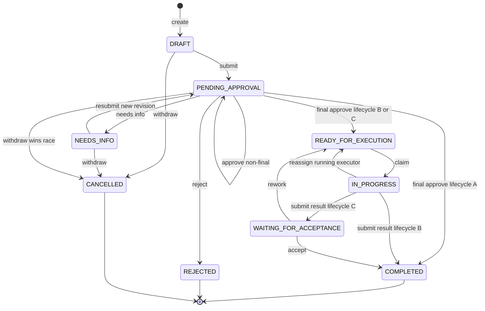
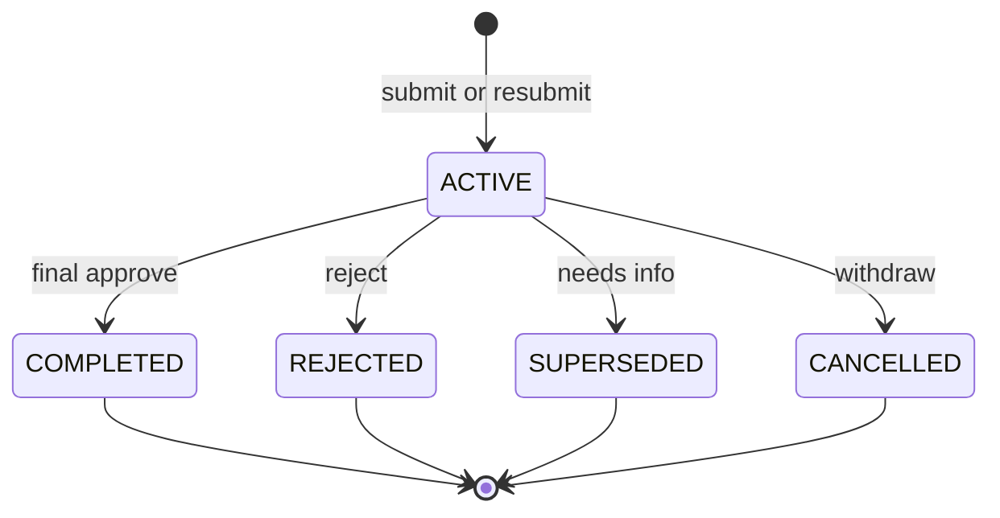
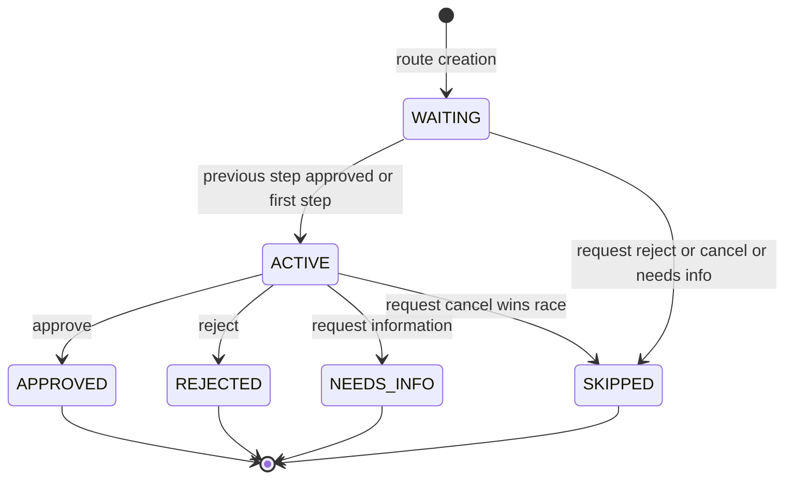
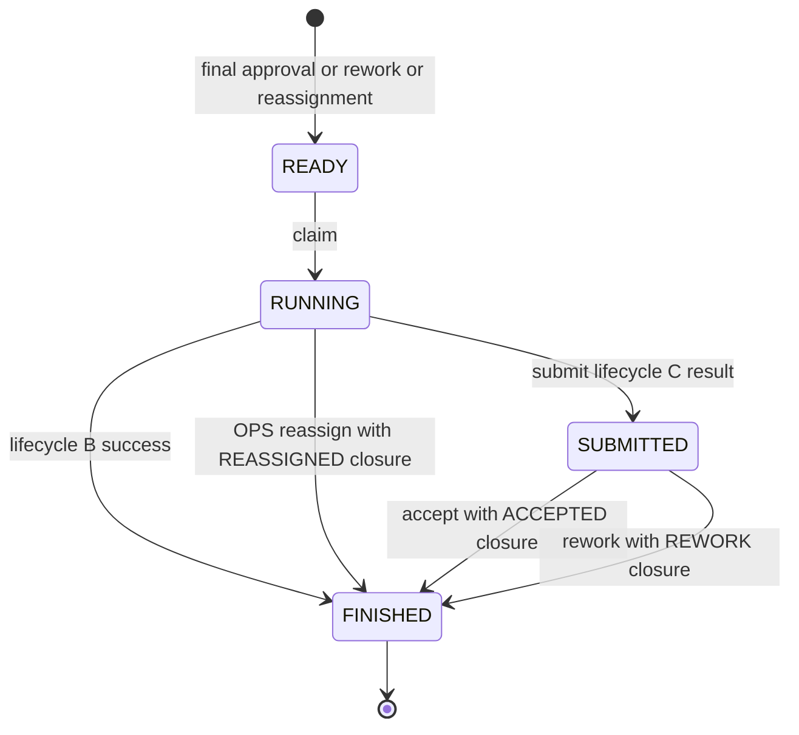
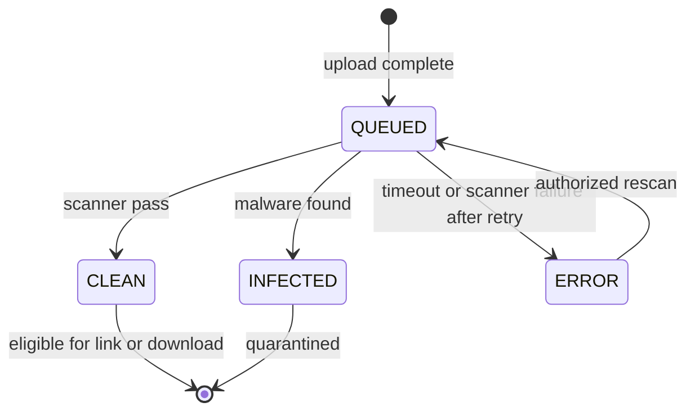
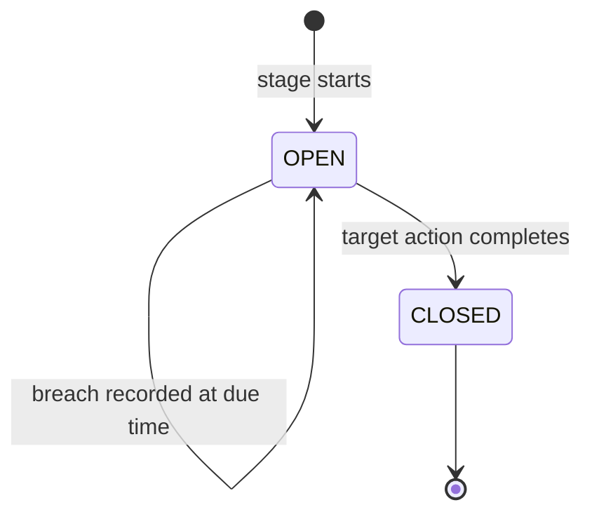
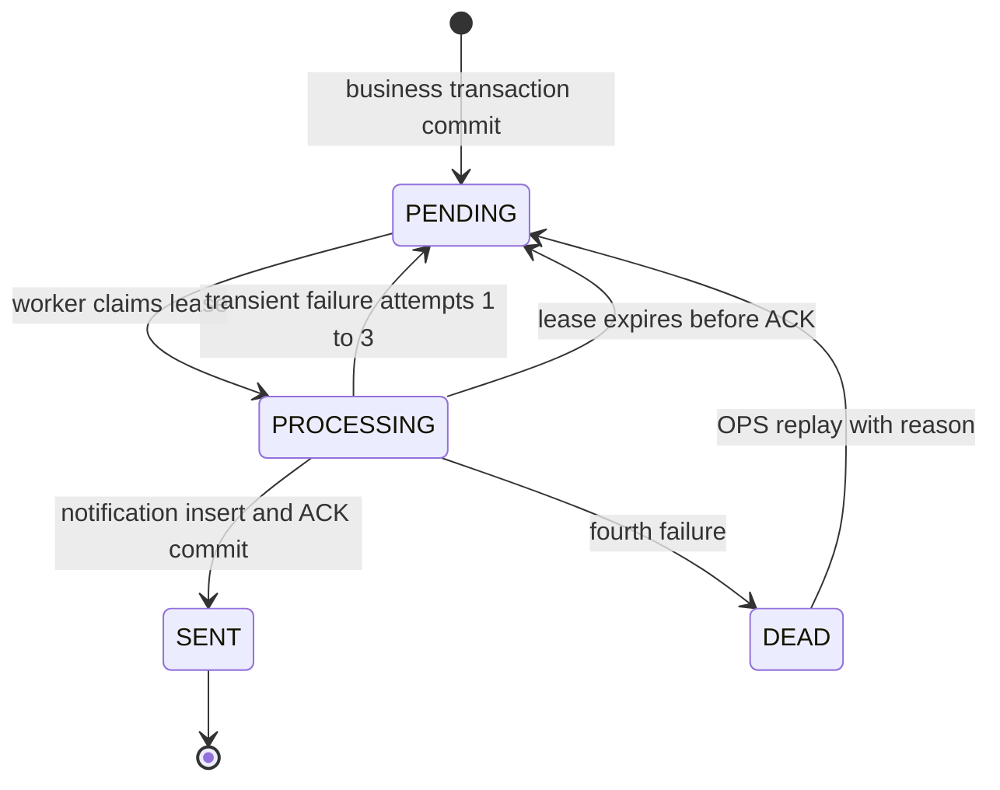
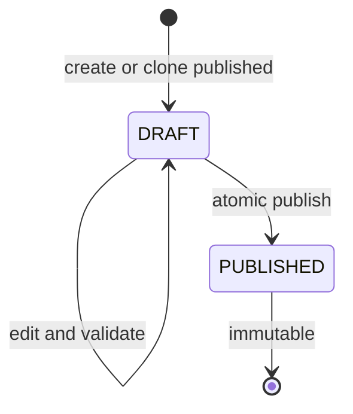

# State-machine diagrams — EAS P0

**Loại:** Target design P0 · **Nguồn:** SRS/SDD v2 + CHECK/trigger trong schema v2.0.1
State machine là chuẩn kiểm tra chéo cho activity, sequence, API guard và state-transition tests.

## ST-01 — Request

Terminal state không được reopen. `NEEDS_INFO` dùng instance mới khi resubmit.

## ST-02 — Workflow instance

Mỗi request có tối đa một instance `ACTIVE`.

## ST-03 — Approval step

Một instance có tối đa một step `ACTIVE`; mỗi step có tối đa một decision.

## ST-04 — Execution attempt

Rework và RUNNING reassignment luôn tạo attempt mới `READY`; không tái mở attempt cũ.

## ST-05 — Attachment scan

Chỉ `CLEAN` được liên kết vào revision/attempt. Tệp lịch sử đang được tham chiếu không được tombstone tùy ý.

## ST-06 — SLA stage

Reminder/breach là alert bất biến, không phải request state. Reassign giữ stage/deadline; rework tạo stage execution mới.

## ST-07 — Outbox event

Lease token cũ không được insert/ACK; notification có dedupe theo event và recipient.

## ST-08 — Config release

Không sửa hoặc unpublish release đã xuất bản. Active pointer có thể chuyển sang release mới; instance cũ giữ snapshot release cũ.

## State-to-test matrix

| State machine | Test case chính |
|---|---|
| ST-01 Request | TC027–038, TC043–055, TC095 |
| ST-02 Instance | TC027, TC032, TC035–038, TC095 |
| ST-03 Approval step | TC031–042, TC095 |
| ST-04 Execution attempt | TC043–055, TC094–095 |
| ST-05 Attachment | TC014–020, TC050, TC079, TC094 |
| ST-06 SLA | TC039, TC049, TC061–064, TC070 |
| ST-07 Outbox | TC028, TC065–069, TC087 |
| ST-08 Config release | TC010–012, TC029, TC097 |
