# Architecture, DFD, deployment và ERD — EAS P0

**Loại:** Target design P0 · **Không phải AS-IS application**
Hiện repository mới có implementation đáng kể ở tầng PostgreSQL/Supabase. Các container/component ứng dụng dưới đây là thiết kế phải triển khai và kiểm chứng.

## AR-01 — System context

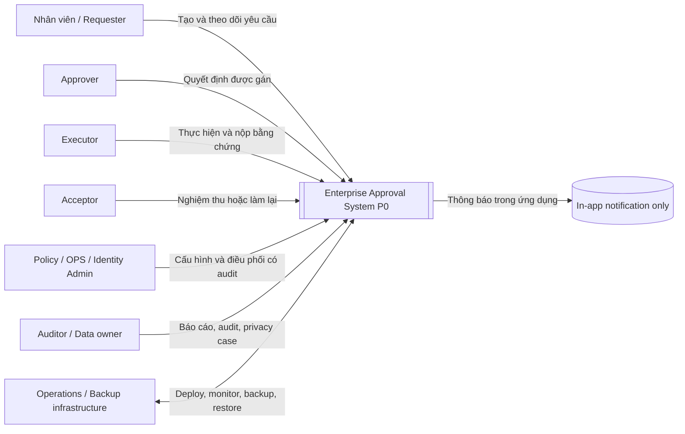

Không có ERP/HRM, payment, mobile push hoặc AI decision trong context P0.

## AR-02 — Logical containers

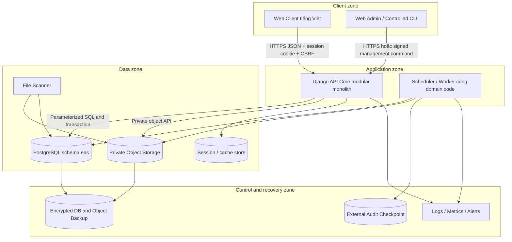

Frontend không truy cập trực tiếp DB. `eas_api`, `eas_worker`, `eas_backup`, `eas_privacy` là technical DB roles tách quyền; không dùng service role như end-user authorization.

## AR-03 — API Core components

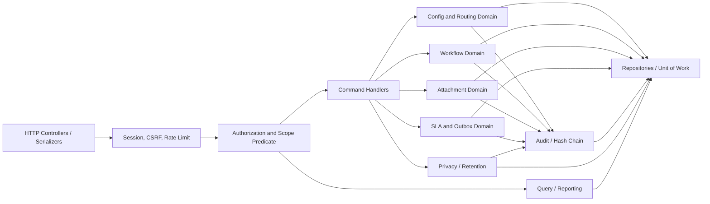

Mọi command handler dùng cùng Unit of Work để domain, audit, outbox và idempotency commit nguyên tử.

## DFD-00 — Context data flow

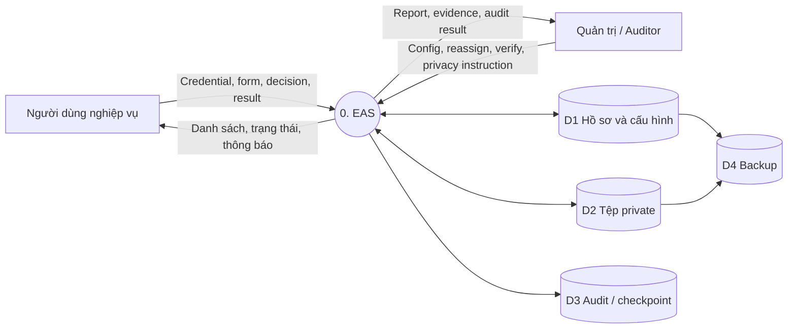

## DFD-01 — Level 1 business processes

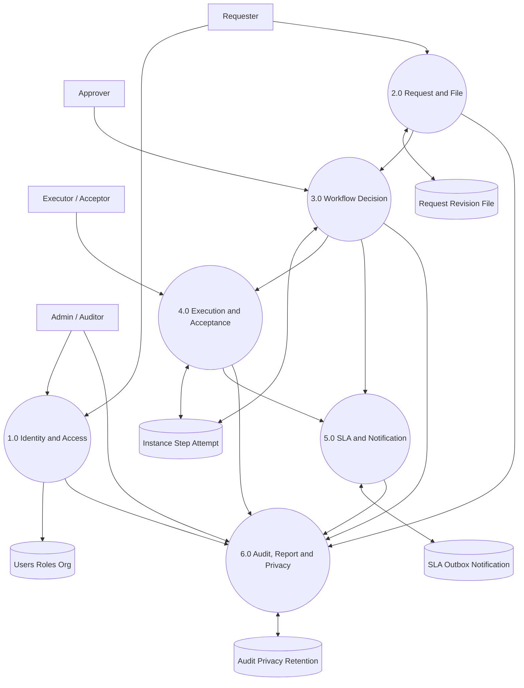

## SEC-01 — Trust boundaries và threat surfaces

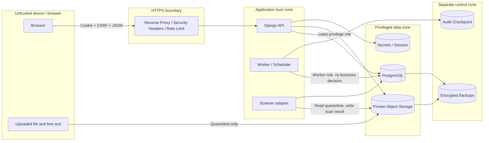

Threat review tối thiểu: credential/session theft, CSRF, IDOR, mass assignment, injection/XSS, malicious upload/path traversal, confused deputy, stale role, race, audit tamper, backup exfiltration và privacy purge misuse.

## DP-01 — Production deployment topology đề xuất

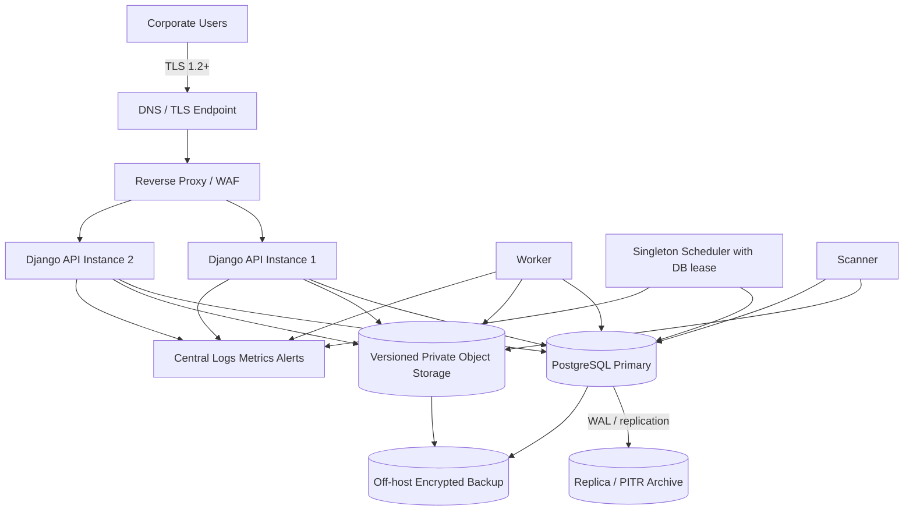

Topology thực tế, sizing, vùng lưu trữ và công cụ backup phải được điền tại KD05/KD06/KD08; hình này không phải bằng chứng hạ tầng đã tồn tại.

## ER-01 — Identity, configuration và request core

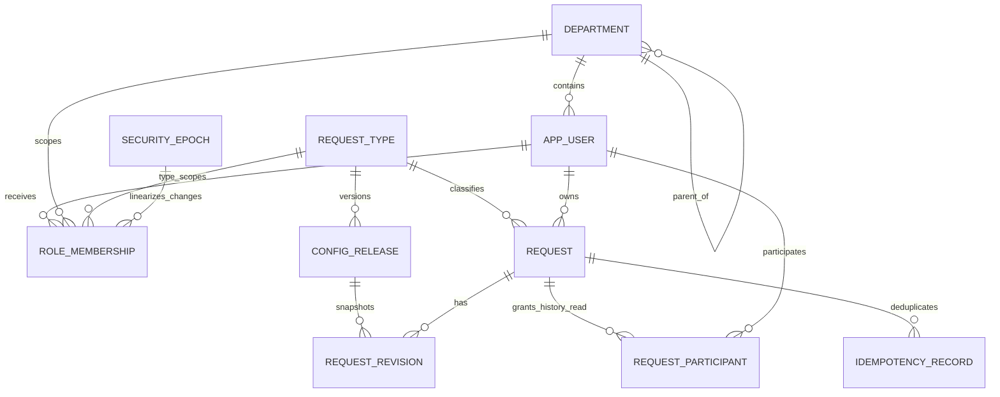

## ER-02 — Workflow, execution và attachment

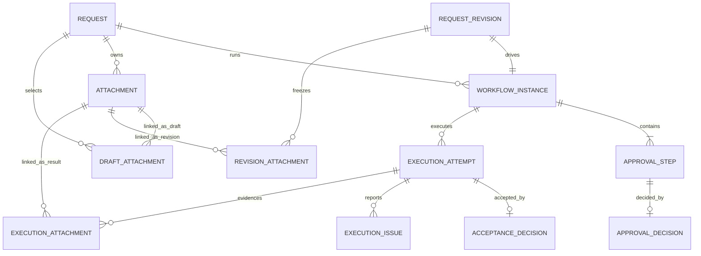

## ER-03 — SLA, event, audit và privacy

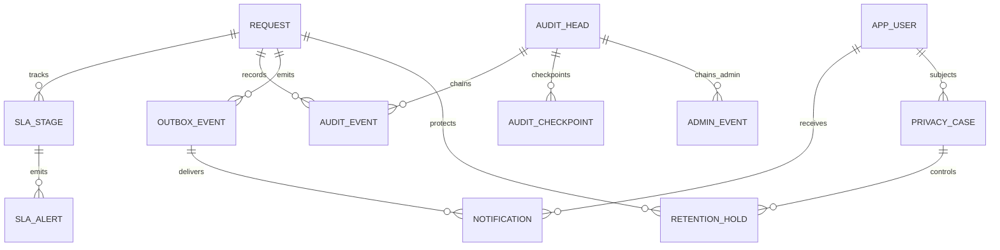

Ba ERD là logical/domain view. Tên cột, composite FK, partial unique, CHECK, trigger và RLS chính xác phải lấy từ tài liệu 03 và `00_eas_supabase_schema.sql`, không suy từ cardinality giản lược trong hình.

## AR-04 — Module dependency direction

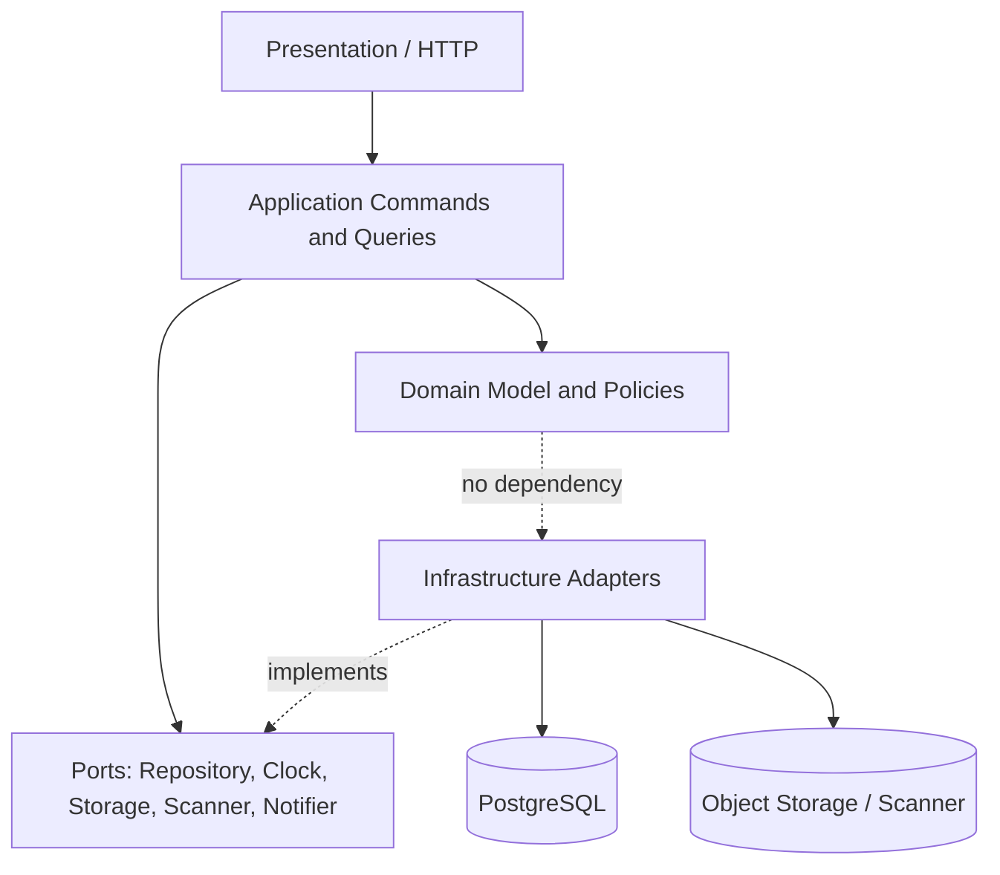

Domain không phụ thuộc Django model side effect hoặc external service. Network call phải ở ngoài transaction giữ row lock; outbox là ranh giới giao bất đồng bộ.

## Diagram-to-evidence matrix

| Diagram | Bằng chứng cần có trước khi đổi nhãn thành AS-IS |
|---|---|
| AR-01/02 | Source tree, API routes, running service inventory |
| AR-03/04 | Package dependency tests, architecture decision record, code review |
| DFD-00/01 | Data inventory, endpoint trace, storage/log/backup mapping |
| SEC-01 | Threat model review, ASVS mapping, penetration evidence |
| DP-01 | IaC/compose manifests, network diagram, secrets/backup/monitoring evidence |
| ER-01/02/03 | Migration catalog, FK/CHECK/index/RLS validation trên PostgreSQL đích |

## ER-04 — Identity và organization chi tiết

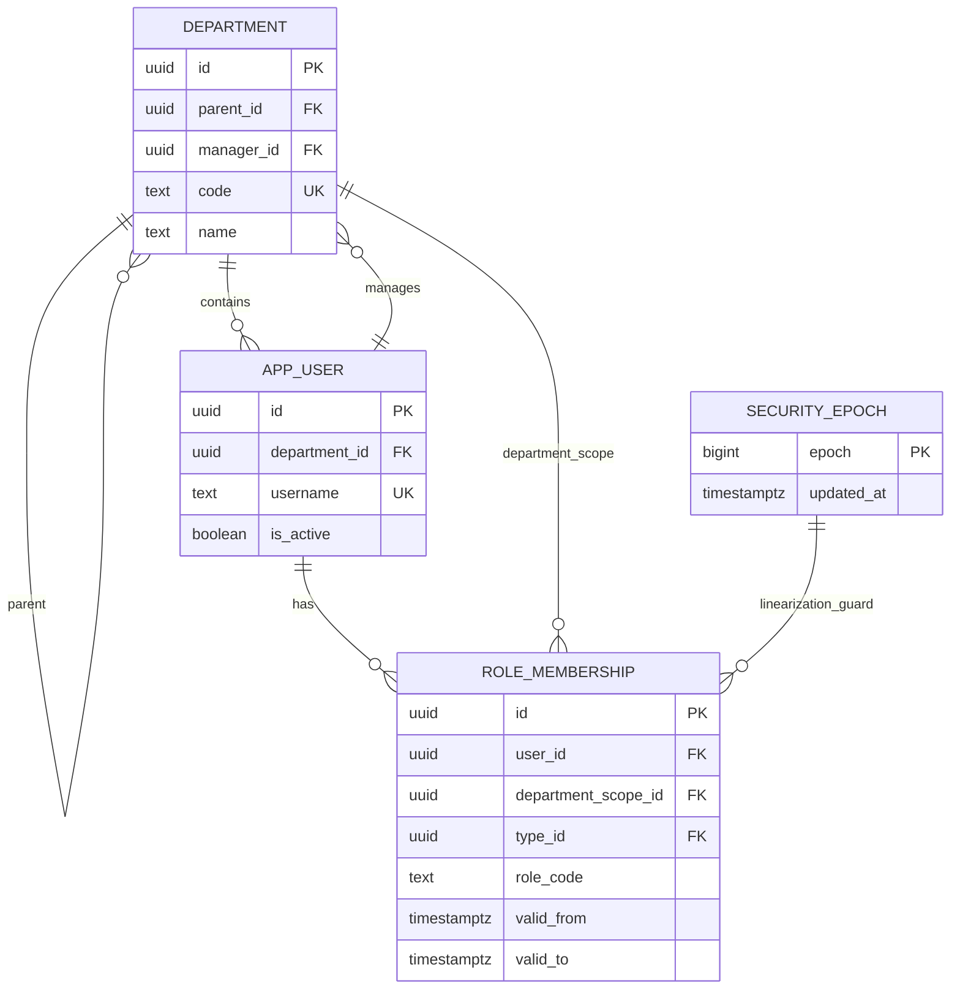

## ER-05 — Request type, config và revision chi tiết

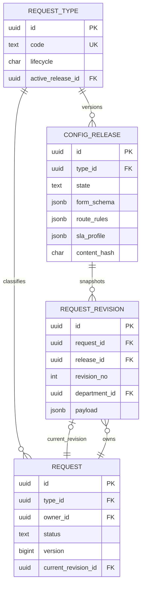

## ER-06 — Approval workflow chi tiết

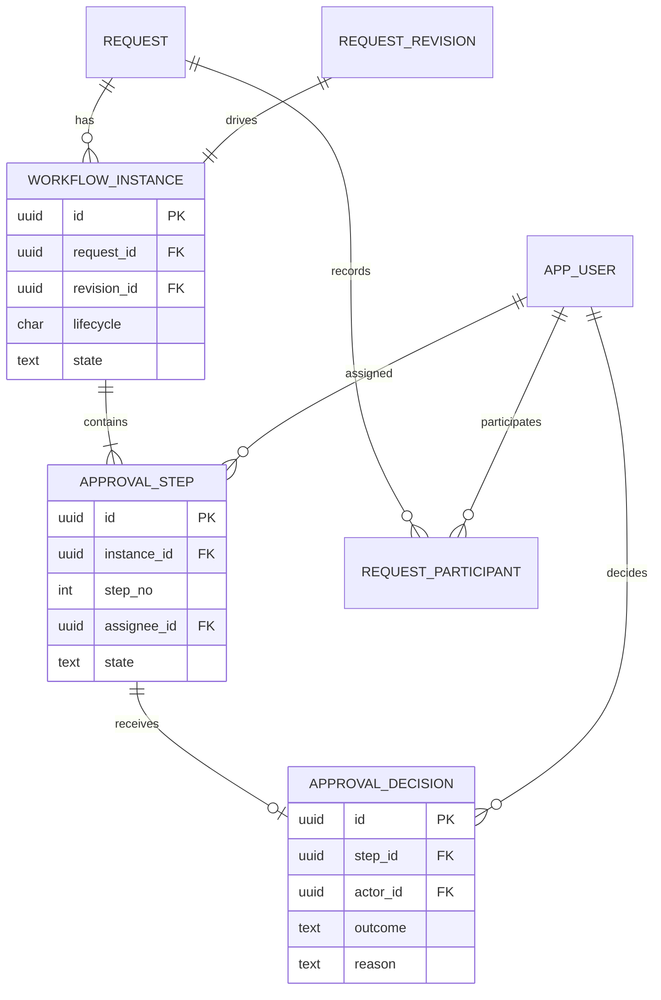

## ER-07 — Execution và acceptance chi tiết

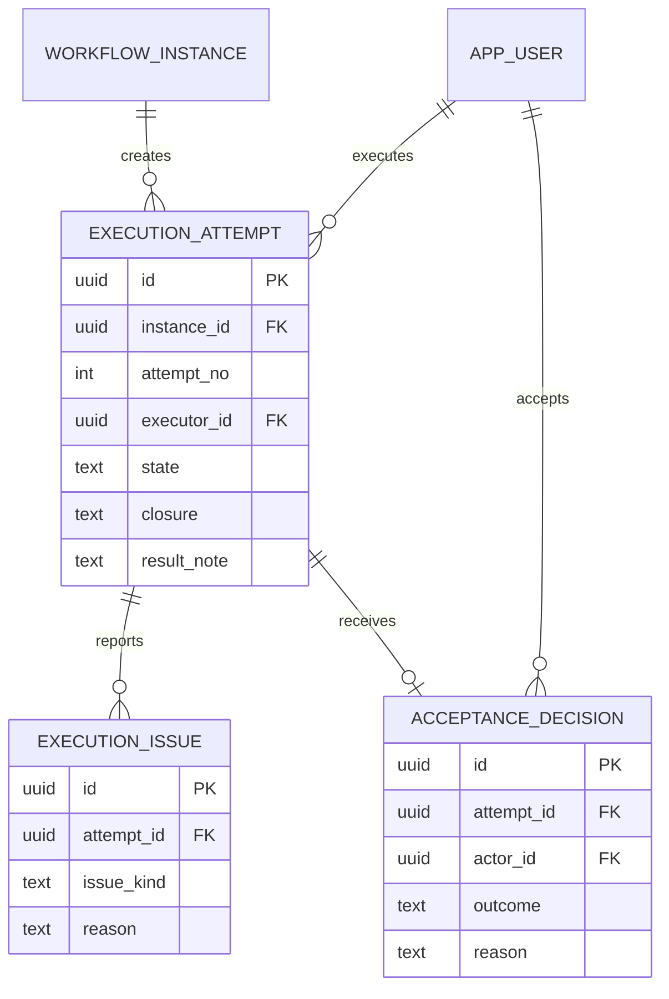

## ER-08 — Attachment và immutable link chi tiết

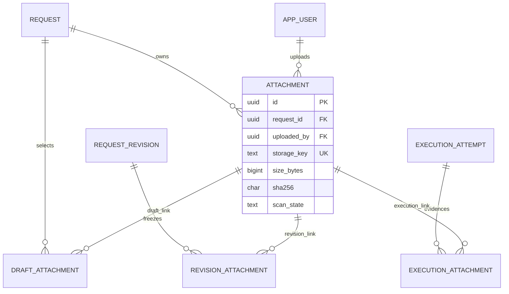

## ER-09 — SLA, outbox và notification chi tiết

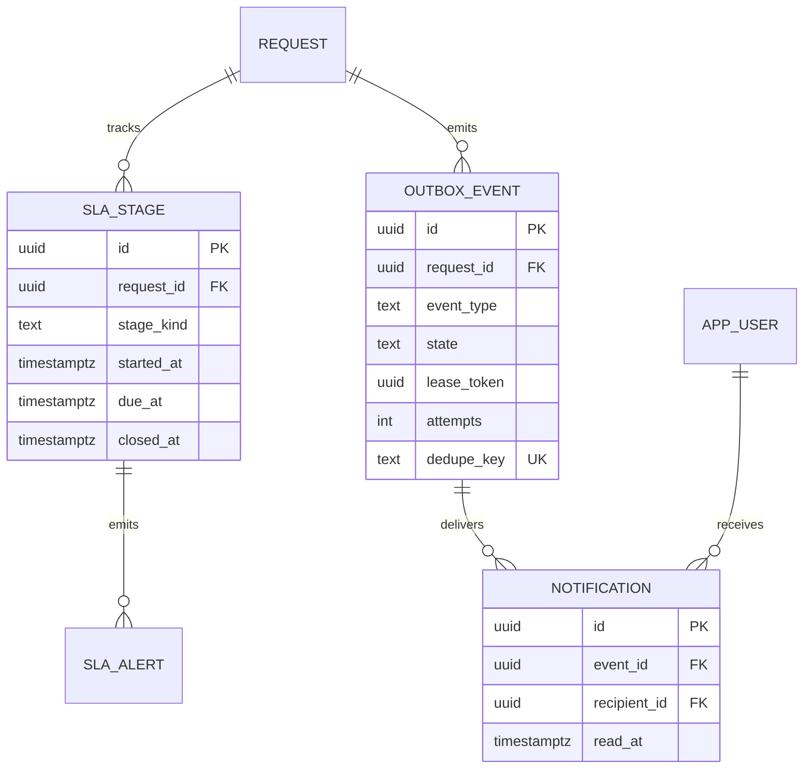

## ER-10 — Audit, idempotency và privacy chi tiết

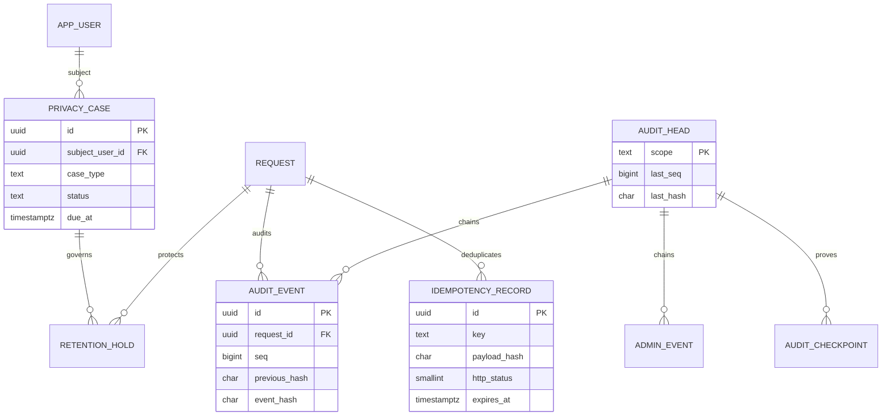

## UI-01 — Sitemap chức năng P0

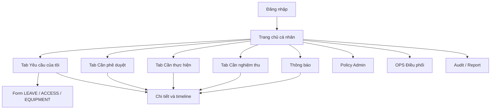
